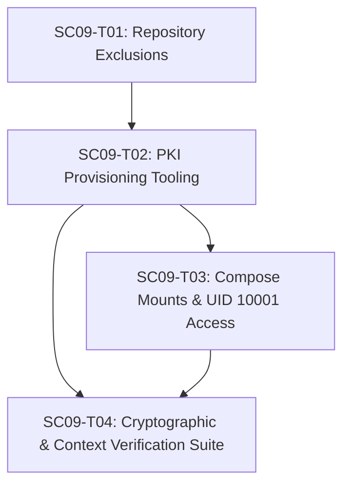

# SC-009 — Establish Development CA and Service Certificates

## Executive Summary & Objectives

SC-009 establishes the **DEVELOPMENT PKI foundation** for SecureCloud's backend service-to-service security architecture (Plane A - Service Identity).

It establishes a reproducible, idempotent PKI provisioning workflow using a private Development Certificate Authority (CA) and provisions unique development service identities (ECDSA P-256 certificates and private keys) for the five microservices:
1. `gateway`
2. `auth`
3. `messaging`
4. `files`
5. `audit`

> [!IMPORTANT]
> SC-009 is purely a PKI and credential provisioning card. It does **NOT** implement gRPC mTLS transports, TLS client/server initialization, handshake verification, or peer authorization logic. Those runtime communication features belong strictly to **SC-010**.

---

## SC-009 → SC-010 Contract

SC-009 guarantees to provide the following artifacts, filesystem layout, and access semantics to SC-010:

1. **CA Trust Anchor**:
   - Host path: `deploy/dev-pki/ca/ca.crt`
   - Container path: `/etc/securecloud/certs/ca.crt` (`read_only: true`)
   - Type: PEM-encoded X.509 v3 Root Certificate (`BasicConstraints: critical, CA:TRUE, pathlen:0`).

2. **Service Keypair**:
   - Host paths:
     - Certificate: `deploy/dev-pki/services/<service>/<service>.crt`
     - Private Key: `deploy/dev-pki/services/<service>/<service>.key`
   - Container paths (`read_only: true`):
     - Certificate: `/etc/securecloud/certs/service.crt`
     - Private Key: `/etc/securecloud/certs/service.key`
   - Key Algorithm: ECDSA P-256 (`prime256v1`), PKCS#8 / PEM format. Cryptographically random per service identity.

3. **Service Identity & SAN Mapping**:
   - Certificate SAN: `DNS:<service>` (where `<service>` matches the exact Docker Compose service DNS name: `gateway`, `auth`, `messaging`, `files`, `audit`).
   - Primary Identity: Compose service DNS name. No `DNS:localhost`, no `IP:127.0.0.1`, no wildcards.
   - KeyUsage: `critical, digitalSignature` (appropriate for ECDSA TLS key exchange).
   - EKU: `serverAuth, clientAuth` (dual server/client TLS role for mTLS).

4. **Runtime Mount & Host Permission Model**:
   - Directory permissions on host: `deploy/dev-pki/ca/` (`chmod 700`), `deploy/dev-pki/services/<service>/` (`chmod 700`).
   - CA private key (`deploy/dev-pki/ca/ca.key`): Permission `0600` (`-rw-------`) on host; **NEVER** mounted into containers.
   - Service private key (`deploy/dev-pki/services/<service>/<service>.key`): Permission `0600` (`-rw-------`) on host.
   - Container execution & mount (`USER 10001:10001`): Mounted as single-file read-only volume (`:ro`). The container process running as non-root `UID 10001` reads `/etc/securecloud/certs/service.key` via container bind-mount namespace while host permissions remain strictly `0600` (blocking all unrelated host users). Container writes are blocked by read-only filesystem mount semantics.

5. **Lifecycle & Regeneration Semantics**:
   - Provisioning is a reproducible, idempotent workflow. Existing CA keys are **never** silently overwritten.
   - Explicit `--force` invocation is required to regenerate the CA, which invalidates existing service certificates and triggers deterministic re-signing.

---

## Ticket Decomposition

### SC09-T01 — Exclude Development PKI Directory and Private Credentials from Version Control and Docker Context

- **Objective**: Guarantee that generated development PKI directories and private keys are strictly excluded from version control and Docker build contexts.
- **Exact files/directories**:
  - `[MODIFY] .gitignore`
  - `[MODIFY] .dockerignore`
- **Dependencies**: SC-007, SC-008
- **Implementation approach**:
  - Add explicit directory exclusion `deploy/dev-pki/` to `.gitignore` as the primary repository protection rule.
  - Retain `*.key` and `*.pem` rules in `.gitignore` and `.dockerignore` as defense-in-depth without obscuring legitimate source code.
  - Verify `.dockerignore` excludes `deploy/dev-pki/` and all private key material from Docker build contexts.
- **Security rules**:
  - CA private key (`ca.key`) and service private keys (`*.key`) MUST NEVER be tracked by Git.
  - PKI credentials MUST NEVER enter Docker image build layers.
- **Validation**:
  - `git check-ignore -v deploy/dev-pki/ca/ca.key`
  - `git check-ignore -v deploy/dev-pki/services/gateway/gateway.key`
  - `git status` check confirming clean repository state when `deploy/dev-pki/` exists.
- **Acceptance criteria**:
  - Attempting to track any file within `deploy/dev-pki/` in Git is blocked.
  - Docker build context ignores `deploy/dev-pki/`.
- **Out of scope**:
  - Writing PKI generation scripts or mounting Compose volumes.

---

### SC09-T02 — Implement Reproducible, Idempotent PKI Provisioning Tooling with Strict Host Permissions

- **Objective**: Create a standard OpenSSL 3.x shell script to implement a reproducible, idempotent PKI provisioning workflow for the Root CA and 5 unique ECDSA P-256 service keypairs with strict host permission model `0600`.
- **Exact files/directories**:
  - `[NEW] scripts/generate-dev-pki.sh`
- **Dependencies**: SC09-T01
- **Implementation approach**:
  - Implement `scripts/generate-dev-pki.sh` using OpenSSL 3.x CLI.
  - Create directory layout with strict permissions: `deploy/dev-pki/ca/` (`chmod 700`), `deploy/dev-pki/services/<service>/` (`chmod 700`).
  - Generate Root CA (`deploy/dev-pki/ca/ca.key`, `ca.crt`) using ECDSA P-256 (`prime256v1`):
    - `basicConstraints = critical, CA:TRUE, pathlen:0`
    - `keyUsage = critical, digitalSignature, cRLSign, keyCertSign`
    - Set `ca.key` host permissions to `chmod 600` (`-rw-------`).
  - For each service (`gateway`, `auth`, `messaging`, `files`, `audit`):
    - Generate unique, cryptographically random ECDSA P-256 keypair (`<service>.key`).
    - Create CSR specifying `CN=<service>.dev.securecloud.local`.
    - Sign certificate (`<service>.crt`) against Root CA with extensions:
      - `basicConstraints = critical, CA:FALSE`
      - `keyUsage = critical, digitalSignature` (strictly appropriate for ECDSA TLS)
      - `extendedKeyUsage = serverAuth, clientAuth`
      - `subjectAltName = DNS:<service>` (Primary & only SAN, matching Compose service key).
    - Set `<service>.key` host permissions strictly to `chmod 600` (`-rw-------`).
    - Set `<service>.crt` host permissions to `chmod 644`.
  - Idempotency guard: Skip CA key creation if `ca.key` exists unless `--force` flag is provided.
- **Security rules**:
  - Service keys MUST be cryptographically random and unique per service. No key sharing.
  - Do NOT use `keyEncipherment` for ECDSA certificates.
  - Do NOT use `DNS:localhost`, `IP:127.0.0.1`, or wildcard SANs.
  - Host permissions MUST be `0600` for both `ca.key` and `<service>.key`. NEVER use `chmod 644` for private keys.
- **Validation**:
  - Execute `scripts/generate-dev-pki.sh`.
  - Check host permissions: `stat -c "%a %n" deploy/dev-pki/ca/ca.key deploy/dev-pki/services/*/*.key` verifies `600`.
  - Inspect generated certs with `openssl x509 -text -noout`.
- **Acceptance criteria**:
  - 5 distinct service keypairs and 1 Root CA generated in `deploy/dev-pki/`.
  - All private keys on host have mode `0600` (not world-readable).
  - Service certificates contain `CA:FALSE`, `keyUsage = digitalSignature`, `extendedKeyUsage = serverAuth, clientAuth`, and `SAN = DNS:<service>`.
  - Script is idempotent and preserves existing CA unless `--force` is passed.
- **Out of scope**:
  - Container configuration or gRPC transport initialization.

---

### SC09-T03 — Configure Read-Only Compose Runtime Certificate Mounts and Non-Root Access Validation

- **Objective**: Mount the PKI trust anchor and service identity credentials into Docker Compose service containers as read-only volumes, and empirically validate non-root read access and write protection.
- **Exact files/directories**:
  - `[MODIFY] deploy/compose/docker-compose.yml`
- **Dependencies**: SC09-T01, SC09-T02, SC-008
- **Implementation approach**:
  - Update `deploy/compose/docker-compose.yml` to define single-file read-only volume mounts for each service (`gateway`, `auth`, `messaging`, `files`, `audit`):
    - `../../deploy/dev-pki/ca/ca.crt:/etc/securecloud/certs/ca.crt:ro`
    - `../../deploy/dev-pki/services/<service>/<service>.crt:/etc/securecloud/certs/service.crt:ro`
    - `../../deploy/dev-pki/services/<service>/<service>.key:/etc/securecloud/certs/service.key:ro`
  - Specify `read_only: true` (`:ro`) for all credential mounts.
- **Security rules**:
  - Credentials MUST be mounted read-only (`:ro`).
  - Container process (running as UID 10001) MUST be able to read `/etc/securecloud/certs/service.key`.
  - Container process MUST NOT be able to modify or write to `/etc/securecloud/certs/`.
  - Host key permission remains `0600` (not world-readable on host OS).
  - MUST NOT configure gRPC TLS, mTLS handshakes, or authorization (SC-010 domain).
- **Validation**:
  - `docker compose config` validation.
  - Non-root readability empirical test:
    `docker compose run --rm gateway test -r /etc/securecloud/certs/service.key` (returns exit code 0).
  - Non-root write-prevention empirical test:
    `docker compose run --rm gateway touch /etc/securecloud/certs/service.key` (fails with `Read-only file system` / exit code 1).
  - Host permission empirical check:
    `test "$(stat -c '%a' deploy/dev-pki/services/gateway/gateway.key)" = "600"` (returns exit code 0).
- **Acceptance criteria**:
  - Compose configuration passes validation.
  - Non-root UID 10001 container process can read mounted certificate and key (`test -r` passes).
  - Non-root UID 10001 container process cannot write to mounted files (`touch` fails).
  - Host file permissions for private keys remain strictly `0600`.
- **Out of scope**:
  - Implementing C++ gRPC TLS credentials or mTLS handshakes.

---

### SC09-T04 — Implement Cryptographic PKI Verification Suite and Build-Context Audit

- **Objective**: Provide comprehensive automated empirical validation for PKI cryptographic chaining, extension validity, key matching, key uniqueness, non-root permissions, Git exclusions, and Docker build-context isolation.
- **Exact files/directories**:
  - `[NEW] scripts/verify-dev-pki.sh`
- **Dependencies**: SC09-T01, SC09-T02, SC09-T03
- **Implementation approach**:
  - Implement `scripts/verify-dev-pki.sh` executing empirical checks:
    1. **CA BasicConstraints & Pathlen**: Verify `CA:TRUE` and `pathlen:0`.
    2. **Service BasicConstraints**: Verify `CA:FALSE` for all 5 service certs.
    3. **Cryptographic Chaining**: Verify `openssl verify -CAfile ca.crt <service>.crt` returns `OK` for all 5 services.
    4. **SAN Identity Match**: Verify `openssl x509 -text -noout` contains exact `DNS:<service>` (and no extra/wildcard SANs).
    5. **Key Usage & EKU**: Verify `keyUsage` has `digitalSignature` (no `keyEncipherment`) and `extendedKeyUsage` has `serverAuth, clientAuth`.
    6. **Key-Certificate Match**: Verify `openssl pkey -pubkey -in <service>.key` matches `openssl x509 -pubkey -in <service>.crt`.
    7. **Public Key Uniqueness**: Verify all 5 service public keys and CA public key are distinct.
    8. **Host Permission Model**: Verify `ca.key` and all `<service>.key` files have mode `0600` on host.
    9. **Git Exclusion Audit**: Verify `git check-ignore` reports `deploy/dev-pki/` and `.key` files are ignored.
    10. **Docker Context Isolation Audit**: Run `docker build --no-cache` context size check or tar dry-run ensuring `deploy/dev-pki/` is not sent in build context payload (without outputting key contents).
    11. **Container Non-Root Read & Write Audit**: Execute container empirical `test -r` and `touch` checks verifying UID 10001 access and read-only protection.
- **Security rules**:
  - Must return non-zero exit code if any cryptographic, permission, or exclusion check fails.
  - Must NOT print private key contents to stdout/stderr.
- **Validation**:
  - Execute `./scripts/verify-dev-pki.sh`.
- **Acceptance criteria**:
  - All verification steps pass with clean exit code `0`.
- **Out of scope**:
  - Live mTLS handshake testing (SC-010).

---

## Dependency Graph & Implementation Sequence

### Recommended Implementation Sequence
1. **SC09-T01**: Repository Git & Docker context exclusion boundaries first.
2. **SC09-T02**: Reproducible PKI generation script (`scripts/generate-dev-pki.sh`) with `0600` host permissions.
3. **SC09-T03**: Docker Compose read-only single-file volume mounts and UID 10001 non-root readability/write-restriction validation.
4. **SC09-T04**: Cryptographic verification suite (`scripts/verify-dev-pki.sh`) and build-context audit.

### Parallelizable Work
- SC09-T03 and SC09-T04 can be drafted concurrently after SC09-T02 is completed.

---

## Risks, Blockers & Mitigation Strategy

1. **Host-Container Permission Protection**:
   - *Mitigation*: Service keys on host have strict `0600` mode (`-rw-------`). Docker single-file read-only bind mounts (`:ro`) allow non-root container UID 10001 to read `/etc/securecloud/certs/service.key` while blocking writes (`Read-only file system`) and preventing unrelated host users from reading the key.
2. **Accidental CA Overwrite**:
   - *Mitigation*: Script checks for existing `ca.key` and aborts unless `--force` is explicitly provided.
3. **Incorrect ECDSA KeyUsage**:
   - *Mitigation*: Omit `keyEncipherment` for ECDSA certs; use `digitalSignature` only. Verify via OpenSSL text dump in T04.
