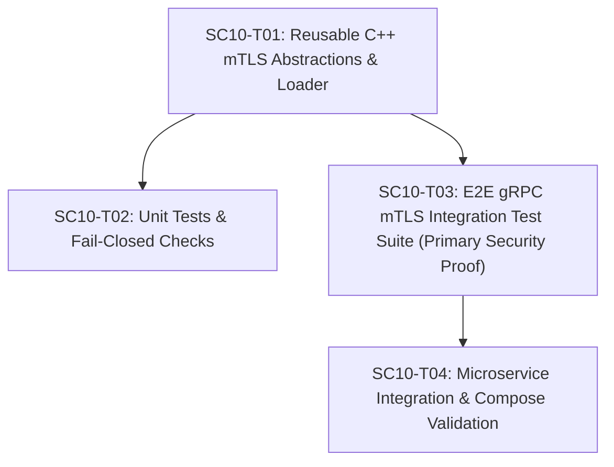

# SC-010 — Establish Service-to-Service mTLS Foundation

## Executive Summary & Objectives

SC-010 establishes the foundational **runtime mutual TLS (mTLS) mechanism** for backend service-to-service communication (Plane A - Service Identity).

It consumes the local development PKI foundation created in **SC-009** (`deploy/dev-pki/` mounted read-only at `/etc/securecloud/certs/`) and implements reusable, production-grade gRPC C++ mTLS credentials loading, client certificate verification, SAN-based service identity authentication, and fail-closed security semantics across all five microservices (`gateway`, `auth`, `messaging`, `files`, `audit`).

> [!IMPORTANT]
> SC-010 enforces **true mutual TLS**. Server endpoints strictly require and verify client certificates signed by the SecureCloud CA (`GRPC_SSL_REQUEST_AND_REQUIRE_CLIENT_CERTIFICATE_AND_VERIFY`), and validate that peer certificates contain expected service identity SANs (`DNS:<service>`). Plaintext fallbacks and insecure certificate verification skips (`insecure_skip_verify`) are strictly prohibited.

---

## Security Architecture & Concept Distinctions

SC-010 clearly separates five distinct security concepts:

1. **CA / Certificate Validation**:
   - Verifies that peer certificates chain directly to the SecureCloud Root CA (`ca.crt`) and satisfy X.509 v3 constraints (`CA:FALSE`, validity periods, `digitalSignature`).
2. **TLS Hostname / SAN Identity Validation**:
   - Uses `GRPC_SSL_TARGET_NAME_OVERRIDE_ARG` matching `DNS:<service>` to ensure the TLS handshake validates that the server certificate SAN matches the intended target service identity. Certificate SAN is the single **authoritative** identity source (no fallback to CN).
3. **Mutual Client Certificate Authentication**:
   - Servers enforce mandatory client certificate presentation (`GRPC_SSL_REQUEST_AND_REQUIRE_CLIENT_CERTIFICATE_AND_VERIFY`), rejecting unauthenticated client connections and client certificates not signed by the SecureCloud CA.
4. **Post-Handshake Peer Identity Extraction**:
   - Extracts the authenticated SAN identity (`x509_subject_alternative_name`) from `grpc::AuthContext` post-handshake for downstream context propagation. SAN DNS is used **exclusively**; if no valid SAN DNS identity exists, identity extraction fails closed (returns `std::nullopt`). Never fall back to CN.
5. **Application Authorization (Out of Scope)**:
   - Scoping granular RPC operation permissions based on authenticated identity belongs to subsequent cards (SC-015/SC-016). SC-010 establishes the cryptographic peer identity baseline only.

---

## SC-009 → SC-010 Contract Consumption

SC-010 strictly consumes the PKI artifacts and runtime mounts established by SC-009:

1. **CA Trust Anchor**: `/etc/securecloud/certs/ca.crt` (Root CA, ECDSA P-256, `CA:TRUE`, `pathlen:0`).
2. **Service Certificate**: `/etc/securecloud/certs/service.crt` (ECDSA P-256, `CA:FALSE`, `digitalSignature`, `serverAuth, clientAuth`, `SAN = DNS:<service>`).
3. **Service Private Key**: `/etc/securecloud/certs/service.key` (ECDSA P-256, Host permission `0600`, mounted read-only `:ro`).
4. **Service Process**: Executes as non-root `USER 10001:10001`.

---

## Ticket Decomposition

### SC10-T01 — Implement Reusable C++ gRPC mTLS Infrastructure & Fail-Closed Credential Loader

- **Objective**: Create reusable, fail-closed gRPC C++ mTLS configuration abstractions and credential loaders in `securecloud::common::security`.
- **Exact files/directories**:
  - `[NEW] src/common/include/securecloud/security/mtls_config.hpp`
  - `[NEW] src/common/src/security/mtls_config.cpp`
  - `[MODIFY] src/common/CMakeLists.txt`
- **Dependencies**: SC-009, SC-006, SC-007, SC-008
- **Implementation approach**:
  - Define `SecurityCredentialsConfig` struct specifying filesystem paths for `ca_cert_path`, `service_cert_path`, `service_key_path`.
  - Implement `MtlsCredentialLoader`:
    - Safely read credential files from disk into memory buffers.
    - Fail closed (return error status / throw `std::runtime_error`) if any file is missing, unreadable, or empty. Never proceed with partial or missing credentials.
  - Implement `CreateMtlsServerCredentials(config)`:
    - Construct `grpc::SslServerCredentialsOptions`.
    - Set `client_certificate_request = GRPC_SSL_REQUEST_AND_REQUIRE_CLIENT_CERTIFICATE_AND_VERIFY` (mandatory client cert requirement).
    - Set `pem_root_certs` to CA certificate content.
    - Set `pem_key_cert_pairs` to local service key & cert pair.
    - Return `grpc::SslServerCredentials(options)`.
  - Implement `CreateMtlsClientCredentials(config)`:
    - Construct `grpc::SslCredentialsOptions` with `pem_root_certs`, `pem_private_key`, `pem_cert_chain`.
    - Return `grpc::SslCredentials(options)`.
  - Implement `CreateMtlsChannel(target_address, config, expected_peer_service_name)`:
    - Configure `grpc::ChannelArguments` with `GRPC_SSL_TARGET_NAME_OVERRIDE_ARG` matching `expected_peer_service_name` (e.g. `auth`).
    - Return `grpc::CreateCustomChannel(...)`.
  - Implement `ExtractPeerServiceIdentity(const grpc::AuthContext& auth_context)`:
    - Verify `auth_context.IsPeerAuthenticated()` is `true`.
    - Extract SAN DNS name (`x509_subject_alternative_name`) **exclusively**. If no valid SAN DNS identity exists, fail closed (return `std::nullopt`). Never fall back to CN.
  - Implement `VerifyPeerServiceIdentity(const grpc::AuthContext& auth_context, std::string_view expected_service_name)`:
    - Validate extracted peer SAN identity matches `expected_service_name`.
- **Security rules**:
  - NEVER print or log private key contents or full PEM credentials.
  - NEVER use `grpc::InsecureServerCredentials()` or `grpc::InsecureChannelCredentials()` in mTLS code paths.
  - Server MUST require client certificate verification (`GRPC_SSL_REQUEST_AND_REQUIRE_CLIENT_CERTIFICATE_AND_VERIFY`).
  - Certificate SAN is the single authoritative source of service identity. SAN DNS is used exclusively (no CN fallback).
  - Fail closed if credential files cannot be loaded.
- **Validation**:
  - Compile `securecloud_common` library (`cmake --build build --target securecloud_common`).
- **Acceptance criteria**:
  - `securecloud_common` compiles cleanly with C++20 flags.
  - Fail-closed credential loading blocks missing/empty file paths.
  - Server credentials explicitly configure `GRPC_SSL_REQUEST_AND_REQUIRE_CLIENT_CERTIFICATE_AND_VERIFY`.
  - Client channel configuration explicitly sets `GRPC_SSL_TARGET_NAME_OVERRIDE_ARG`.
  - SAN-only identity extraction returns `std::nullopt` if SAN DNS is missing (zero CN fallback).
  - Insecure credentials (`InsecureServerCredentials` / `InsecureChannelCredentials`) are strictly absent from mTLS abstractions.
- **Out of scope**:
  - Application-level authorization policies, Signal E2E encryption, or service mesh.

---

### SC10-T02 — Implement Unit Tests for Credential Loading, Fail-Closed File Parsing, and Helper Logic

- **Objective**: Provide unit test coverage for credential file loading, malformed input handling, and fail-closed configuration parsing.
- **Exact files/directories**:
  - `[NEW] tests/unit/security/mtls_config_test.cpp`
  - `[MODIFY] tests/unit/CMakeLists.txt`
- **Dependencies**: SC10-T01
- **Implementation approach**:
  - Write GoogleTest suite in `tests/unit/security/mtls_config_test.cpp`:
    1. **Missing CA File Test**: Verify loading fails closed when `ca.crt` path does not exist.
    2. **Missing Service Key Test**: Verify loading fails closed when `service.key` path does not exist.
    3. **Empty File Test**: Verify loading fails closed when credential file is empty.
    4. **Valid Credential Construction Test**: Verify `SslServerCredentials` and `SslCredentials` build successfully when valid dev PKI files are supplied.
    5. **SAN-Only Identity Extraction Unit Test**: Verify SAN DNS extraction succeeds and missing SAN DNS fails closed without fallback to CN.
- **Security rules**:
  - Unit tests focus on configuration and file loading behavior; live network peer authentication is tested in SC10-T03.
  - Tests must NOT modify or overwrite local development PKI files destructively.
- **Validation**:
  - Run `ctest --preset dev-debug --tests-regex MtlsConfigTest`.
- **Acceptance criteria**:
  - All unit tests pass with 100% success rate.
- **Out of scope**:
  - Live socket handshakes.

---

### SC10-T03 — Implement End-to-End gRPC mTLS Integration Test Suite (Authoritative Security Proof)

- **Objective**: Create a live gRPC integration test suite demonstrating actual mTLS handshakes over localhost sockets as the authoritative security proof for peer authentication, SAN identity validation, and negative security attacks.
- **Exact files/directories**:
  - `[NEW] tests/integration/mtls_integration_test.cpp`
  - `[NEW] tests/integration/CMakeLists.txt`
  - `[MODIFY] tests/CMakeLists.txt`
- **Dependencies**: SC10-T01
- **Implementation approach**:
  - Write gRPC integration test using Health gRPC service (`proto/securecloud/common/v1/health.proto`):
    - Start in-process gRPC mTLS server bound to localhost ephemeral port (`127.0.0.1:0`) using `CreateMtlsServerCredentials()` loaded with `auth` service identity.
    - **Positive Test 1 (Valid Gateway -> Auth mTLS)**:
      - Client initialized with `gateway` credentials and target SAN override `auth`.
      - Issue `Check` RPC.
      - *Expected*: Handshake succeeds, RPC returns `SERVING`, server verifies client peer SAN as `gateway`.
    - **Negative Test 2 (Untrusted CA)**:
      - Client initialized with an untrusted/self-signed Root CA cert.
      - *Expected*: Handshake fails, RPC returns `UNAUTHENTICATED` or `UNAVAILABLE`.
    - **Negative Test 3 (Missing Client Certificate)**:
      - Client initialized with TLS credentials containing server CA trust but NO client certificate/key.
      - *Expected*: Server rejects connection, RPC returns `UNAUTHENTICATED`.
    - **Negative Test 4 (Server SAN Identity Mismatch)**:
      - Server presents cert SAN `DNS:auth`, but client configures expected peer identity `messaging`.
      - *Expected*: Target SAN mismatch check fails, TLS handshake/RPC fails.
    - **Negative Test 5 (Wrong Client Identity Test)**:
      - Client presents valid, trusted cert SAN `DNS:audit`, but server handler expects client identity `gateway`.
      - *Expected*: TLS authentication succeeds (trusted CA), but post-handshake identity check rejects connection (`UNAUTHENTICATED`).
    - **Negative Test 6 (Plaintext Connection Attack)**:
      - Client attempts insecure connection using `grpc::InsecureChannelCredentials()`.
      - *Expected*: Connection rejected immediately by mTLS server.
    - **Negative Test 7 (Mismatched Key/Cert Startup)**:
      - Server initialized with `auth.crt` but `gateway.key`.
      - *Expected*: Fail-closed startup failure.
- **Security rules**:
  - Must use actual socket handshakes over localhost loopback interface.
  - Must serve as the primary authoritative security proof for mTLS peer authentication.
- **Validation**:
  - Run `ctest --preset dev-debug --tests-regex MtlsIntegrationTest`.
- **Acceptance criteria**:
  - Positive mTLS RPCs succeed with verified peer identity.
  - All 6 negative security tests fail closed as expected.
- **Out of scope**:
  - Docker Compose container deployment.

---

### SC10-T04 — Integrate Fail-Closed mTLS Infrastructure into Backend Microservices and Compose Validation

- **Objective**: Wire the reusable mTLS server configuration into all five microservices (`gateway`, `auth`, `messaging`, `files`, `audit`) using internal development listener ports and validate runtime execution in Docker Compose.
- **Exact files/directories**:
  - `[MODIFY] src/gateway/main.cpp`
  - `[MODIFY] src/auth/main.cpp`
  - `[MODIFY] src/messaging/main.cpp`
  - `[MODIFY] src/files/main.cpp`
  - `[MODIFY] src/audit/main.cpp`
- **Dependencies**: SC10-T01, SC10-T03, SC-008, SC-009
- **Implementation approach**:
  - Update each service `main.cpp` to:
    - Read credential paths from `/etc/securecloud/certs/ca.crt`, `service.crt`, `service.key`.
    - Load mTLS server credentials using `CreateMtlsServerCredentials()`.
    - Register Health gRPC service (`grpc::HealthCheckServiceInterface`).
    - Bind gRPC server to `0.0.0.0:<port>` using assigned development listener ports:
      - `gateway`: `50051`
      - `auth`: `50052`
      - `messaging`: `50053`
      - `files`: `50054`
      - `audit`: `50055`
    - Log safe initialization diagnostic info (service name, port, mTLS status).
    - Handle shutdown signals (`SIGINT`/`SIGTERM`) cleanly.
- **Security rules**:
  - Service MUST NOT start without valid mTLS credentials (fail closed).
  - Plaintext listeners MUST NOT be created.
  - All 5 services prove they can initialize their own mTLS server identity using mounted credentials.
  - Distinguish successful process startup from full mTLS handshake proof (SC10-T03 provides handshake proof).
- **Validation**:
  - Run `docker compose -f deploy/compose/docker-compose.yml build`.
  - Execute `docker compose -f deploy/compose/docker-compose.yml up` and verify all 5 microservices start up with mTLS active and listen on their assigned internal gRPC ports.
  - Run `verify-dev-pki.sh` and CTest suite.
- **Acceptance criteria**:
  - All 5 backend services start with mTLS enabled using mounted `/etc/securecloud/certs/` credentials.
  - Compose services run without crashes.
- **Out of scope**:
  - Inter-service business logic RPCs or application authorization policies.

---

## Dependency Graph & Implementation Sequence

### Recommended Implementation Sequence
1. **SC10-T01**: Reusable C++ mTLS security infrastructure and fail-closed credential loaders in `securecloud::common`.
2. **SC10-T02** & **SC10-T03** (Parallelizable):
   - **SC10-T02**: Unit tests for credential loading and file error handling (`tests/unit/security/mtls_config_test.cpp`).
   - **SC10-T03**: Primary security proof via live localhost gRPC mTLS integration test suite (`tests/integration/mtls_integration_test.cpp`).
3. **SC10-T04**: Integrate mTLS server initialization into the 5 backend microservices (`main.cpp`) and validate in Docker Compose.

---

## Risks, Blockers & Mitigation Strategy

1. **gRPC Target SAN Override**:
   - *Mitigation*: Set `GRPC_SSL_TARGET_NAME_OVERRIDE_ARG` on client channel arguments matching `expected_peer_service_name` (`DNS:<service>`). SAN is authoritative.
2. **In-Process Ephemeral Port Binding**:
   - *Mitigation*: Bind integration test server to OS-assigned ephemeral port (`127.0.0.1:0`) to avoid port conflicts during parallel test execution.
