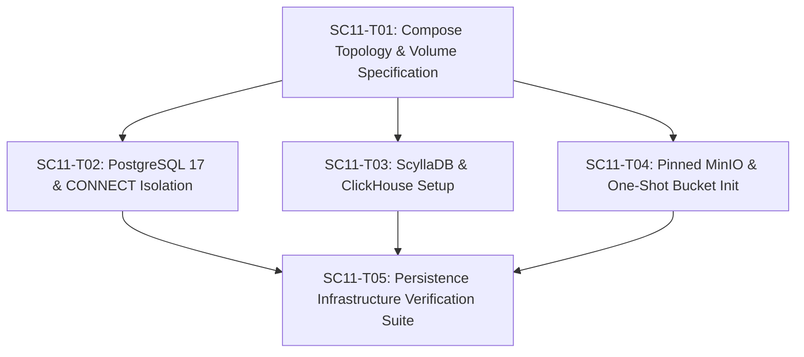

# SC-011 — Establish Development Persistence and Storage Infrastructure

## Executive Summary & Objectives

SC-011 establishes the development persistence and object-storage infrastructure required by the approved SecureCloud polyglot architecture (ADR-005, ADR-006).

It provisions four core infrastructure technologies in Docker Compose:
1. **PostgreSQL 17** (`postgres:17.0-alpine`): Relational database for `auth` (`securecloud_auth`) and `files` metadata (`securecloud_files`).
2. **ScyllaDB** (`scylladb/scylla:6.0.1`): High-throughput distributed NoSQL wide-column database for `messaging`.
3. **ClickHouse** (`clickhouse/clickhouse-server:24.8.3.59-alpine`): Columnar analytical database for `audit` (`securecloud_audit`).
4. **MinIO** (`minio/minio:RELEASE.2024-08-03T04-33-23Z`): S3-compatible encrypted object storage for `files` content (`securecloud-files-encrypted`).

> [!IMPORTANT]
> SC-011 establishes **infrastructure only**. It strictly excludes business schemas, entity tables, domain repositories, CRUD APIs, application-level storage logic, or database abstraction layers. Database ownership boundaries (ADR-005) are strictly enforced at the infrastructure bootstrap layer via database-level `CONNECT` isolation, unprivileged service credentials (`NOSUPERUSER NOCREATEDB NOCREATEROLE NOREPLICATION`), and logically separated databases.

---

## Authoritative Architectural Baseline & Findings

1. **Database Ownership (ADR-005 & ADR-006)**:
   - **Gateway**: Stateless (No database).
   - **Auth**: PostgreSQL 17 (`securecloud_auth` database, owned by `auth_user`).
   - **Files**: PostgreSQL 17 (`securecloud_files` database, owned by `files_user`) + MinIO S3 bucket (`securecloud-files-encrypted`).
   - **Messaging**: ScyllaDB (Node provisioned on `securecloud-dev` network; no application keyspaces/tables created in SC-011).
   - **Audit**: ClickHouse (`securecloud_audit` database, owned by `audit_user`).

2. **PostgreSQL Isolation & User Hardening**:
   - Single PostgreSQL 17 deployment hosting two logically isolated databases (`securecloud_auth`, `securecloud_files`).
   - Service credentials created as `NOSUPERUSER NOCREATEDB NOCREATEROLE NOREPLICATION`.
   - Database-level `CONNECT` privilege isolation enforced:
     `REVOKE CONNECT ON DATABASE securecloud_files FROM PUBLIC, auth_user;`
     `REVOKE CONNECT ON DATABASE securecloud_auth FROM PUBLIC, files_user;`
   - Verification tests effective privileges (connection attempt fails closed with database permission error).
   - Bootstrap uses a shell initialization script (`/docker-entrypoint-initdb.d/init-databases.sh`) inside the container to deterministically process environment variables via `psql`.

3. **Pinned Image Reproducibility**:
   - Floating `latest` tags are strictly prohibited.
   - Pinned image versions:
     - PostgreSQL: `postgres:17.0-alpine`
     - ScyllaDB: `scylladb/scylla:6.0.1`
     - ClickHouse: `clickhouse/clickhouse-server:24.8.3.59-alpine`
     - MinIO: `minio/minio:RELEASE.2024-08-03T04-33-23Z`
     - MinIO Client: `minio/mc:RELEASE.2024-08-13T01-44-32Z`

4. **Host Port Binding & Network Isolation**:
   - All 10 Compose services communicate internally over bridge network `securecloud-dev` using Compose service DNS names (`postgres`, `scylladb`, `clickhouse`, `minio`).
   - Host-exposed ports are explicitly bound to loopback `127.0.0.1` for local debugging/development tools:
     - PostgreSQL: `127.0.0.1:5433:5432`
     - ScyllaDB: `127.0.0.1:9042:9042`
     - ClickHouse: `127.0.0.1:8123:8123` (HTTP)
     - MinIO: `127.0.0.1:9000:9000` (S3 API), `127.0.0.1:9001:9001` (Web Console)

5. **Compose Service Count & One-Shot Helpers**:
   - **Total Compose Services**: 10 services (5 backend microservices, 4 persistence engines, 1 one-shot initialization job `minio-init`).
   - `minio-init` is a one-shot helper container (`restart: "no"`) whose successful exit code `0` is verified during readiness.

6. **Development Credentials Security**:
   - `.env.example` contains development-only placeholders/credentials.
   - Active `.env` files excluded from Git via `.gitignore` AND excluded from Docker build context via `.dockerignore`.

7. **Preservation of SC-008/SC-009/SC-010 Architecture**:
   - Backend microservices run as `UID/GID 10001:10001` with read-only mTLS certificate mounts (`/etc/securecloud/certs/`).
   - Existing 23/23 CTest test suite and `verify-dev-pki.sh` run as non-regression checks in SC11-T05.

---

## Ticket Decomposition

### SC11-T01 — Establish Development Environment Configuration Template & Compose Volume Topology

- **Objective**: Create central environment configuration template (`deploy/compose/.env.example`), update `.gitignore` and `.dockerignore` for active `.env` files, and declare persistent named Docker volumes in `deploy/compose/docker-compose.yml`.
- **Exact files/directories**:
  - `[NEW] deploy/compose/.env.example`
  - `[MODIFY] .gitignore`
  - `[MODIFY] .dockerignore`
  - `[MODIFY] deploy/compose/docker-compose.yml`
- **Dependencies**: SC-008
- **Implementation approach**:
  - Define `deploy/compose/.env.example` specifying development-only credential placeholders for admin superusers and service-specific database users.
  - Update `.gitignore` and `.dockerignore` to ensure active `.env` files are excluded from Git and Docker build contexts.
  - Declare top-level named volumes in `deploy/compose/docker-compose.yml`:
    - `postgres-data`
    - `scylla-data`
    - `clickhouse-data`
    - `minio-data`
- **Security considerations**:
  - `.env.example` contains development-only placeholders. Active `.env` files excluded from version control and Docker contexts.
- **Configuration considerations**:
  - Clear variable names (`POSTGRES_ADMIN_USER`, `AUTH_DB_NAME`, `FILES_DB_NAME`, `MINIO_ROOT_USER`, etc.).
- **Persistence considerations**:
  - Top-level `volumes:` block in Compose.
- **Validation**:
  - Run `docker compose -f deploy/compose/docker-compose.yml config` to verify Compose syntax.
- **Acceptance criteria**:
  - `.env.example` committed. Active `.env` excluded in `.gitignore` and `.dockerignore`.
  - Named volumes declared in Compose topology.
- **Out of scope**:
  - Database container definitions (SC11-T02 to SC11-T04).

---

### SC11-T02 — Configure PostgreSQL 17 Infrastructure with Service-Owned Database Bootstrap & Connect Isolation

- **Objective**: Provision PostgreSQL 17 container (`postgres:17.0-alpine`) in Docker Compose with shell bootstrap initialization script enforcing unprivileged service accounts (`NOSUPERUSER NOCREATEDB NOCREATEROLE NOREPLICATION`) and database-level `CONNECT` privilege isolation for `auth` and `files`.
- **Exact files/directories**:
  - `[NEW] deploy/compose/postgres/init-databases.sh`
  - `[MODIFY] deploy/compose/docker-compose.yml`
- **Dependencies**: SC11-T01
- **Implementation approach**:
  - Create shell script `deploy/compose/postgres/init-databases.sh` mounted into `/docker-entrypoint-initdb.d/init-databases.sh`:
    - Execute `psql` as superuser using environment variables:
      - Create database `securecloud_auth` and user `auth_user` with `NOSUPERUSER NOCREATEDB NOCREATEROLE NOREPLICATION`.
      - Create database `securecloud_files` and user `files_user` with `NOSUPERUSER NOCREATEDB NOCREATEROLE NOREPLICATION`.
      - Grant `auth_user` privileges strictly on `securecloud_auth`.
      - Grant `files_user` privileges strictly on `securecloud_files`.
      - Enforce database `CONNECT` isolation:
        `REVOKE CONNECT ON DATABASE securecloud_files FROM PUBLIC, auth_user;`
        `REVOKE CONNECT ON DATABASE securecloud_auth FROM PUBLIC, files_user;`
  - Add `postgres` service in `deploy/compose/docker-compose.yml`:
    - Image: `postgres:17.0-alpine`.
    - Mount `init-databases.sh` into `/docker-entrypoint-initdb.d/init-databases.sh:ro`.
    - Mount `postgres-data` volume into `/var/lib/postgresql/data`.
    - Network: `securecloud-dev`.
    - Native healthcheck: `pg_isready -U ${POSTGRES_ADMIN_USER:-postgres} -d postgres`.
    - Expose host port `127.0.0.1:5433:5432` for local development debugging.
- **Security considerations**:
  - Service users are unprivileged (`NOSUPERUSER NOCREATEDB NOCREATEROLE NOREPLICATION`).
  - Database `CONNECT` isolation enforced at database level. Effective privilege verification fails closed.
- **Configuration considerations**:
  - Shell script entrypoint interpolates Compose environment variables cleanly.
- **Persistence considerations**:
  - Data stored in `postgres-data` volume.
- **Validation**:
  - Verify PostgreSQL starts, healthcheck passes, `auth_user` can connect to `securecloud_auth`, and `auth_user` connection to `securecloud_files` is rejected at connection handshake with permission denied.
- **Acceptance criteria**:
  - PostgreSQL 17 starts cleanly in Compose.
  - `securecloud_auth` and `securecloud_files` databases created with `CONNECT` isolation.
  - `auth_user` and `files_user` created without administrative privileges.
  - `pg_isready` healthcheck passes.
- **Out of scope**:
  - Creating table schemas, migrations, or C++ database client code.

---

### SC11-T03 — Configure ScyllaDB & ClickHouse Infrastructure with Health Verification

- **Objective**: Provision ScyllaDB (`scylladb/scylla:6.0.1`) for `messaging` and ClickHouse (`clickhouse/clickhouse-server:24.8.3.59-alpine`) for `audit` in Docker Compose with developer-mode parameters, initialization scripts for `securecloud_audit`, and non-blocking native healthchecks.
- **Exact files/directories**:
  - `[NEW] deploy/compose/clickhouse/init-clickhouse.sql`
  - `[MODIFY] deploy/compose/docker-compose.yml`
- **Dependencies**: SC11-T01
- **Implementation approach**:
  - Create `deploy/compose/clickhouse/init-clickhouse.sh` mounted into `/docker-entrypoint-initdb.d/init-clickhouse.sh`:
    - Create database `securecloud_audit` and unprivileged user `audit_user`.
  - Add `scylladb` service in `deploy/compose/docker-compose.yml`:
    - Image: `scylladb/scylla:6.0.1`.
    - Command: `--developer-mode=1 --smp 1 --memory 512M`.
    - Mount `scylla-data` volume into `/var/lib/scylla`.
    - Network: `securecloud-dev`.
    - Native healthcheck: `cqlsh -e "SHOW HOST" || exit 1`.
    - Expose host port `127.0.0.1:9042:9042` for local CQL debugging.
    - Note: Infrastructure only! No Messaging application keyspaces/tables are created in SC-011.
  - Add `clickhouse` service in `deploy/compose/docker-compose.yml`:
    - Image: `clickhouse/clickhouse-server:24.8.3.59-alpine`.
    - Mount `init-clickhouse.sh` into `/docker-entrypoint-initdb.d/init-clickhouse.sh:ro`.
    - Mount `clickhouse-data` volume into `/var/lib/clickhouse`.
    - Network: `securecloud-dev`.
    - Native healthcheck: `wget --no-verbose --tries=1 --spy http://localhost:8123/ping || exit 1`.
    - Expose host ports `127.0.0.1:8123:8123` (HTTP) and `127.0.0.1:9000:9000` (Native) for local debugging.
- **Security considerations**:
  - ClickHouse `audit_user` restricted to `securecloud_audit`. ScyllaDB developer mode scoped strictly to `securecloud-dev` network and loopback bindings.
- **Configuration considerations**:
  - ScyllaDB developer mode parameters constrain RAM/CPU footprint.
- **Persistence considerations**:
  - Data stored in `scylla-data` and `clickhouse-data` volumes.
- **Validation**:
  - Verify ScyllaDB status via `cqlsh` and ClickHouse HTTP `/ping` response.
- **Acceptance criteria**:
  - ScyllaDB (`6.0.1`) and ClickHouse (`24.8.3.59-alpine`) containers start cleanly and pass healthchecks.
  - `securecloud_audit` database created.
  - No Messaging application keyspaces/tables created.
- **Out of scope**:
  - Messaging CQL schemas, Audit ClickHouse table engines, or event ingestion.

---

### SC11-T04 — Configure Pinned MinIO Object Storage Infrastructure & One-Shot Bucket Initialization Job

- **Objective**: Provision MinIO S3 object storage container (`minio/minio:RELEASE.2024-08-03T04-33-23Z`) and one-shot init job (`minio-init`) in Docker Compose to create development object storage bucket `securecloud-files-encrypted` and establish persistent storage volume.
- **Exact files/directories**:
  - `[NEW] deploy/compose/minio/init-minio.sh`
  - `[MODIFY] deploy/compose/docker-compose.yml`
- **Dependencies**: SC11-T01
- **Implementation approach**:
  - Create `deploy/compose/minio/init-minio.sh`:
    - Wait for MinIO service readiness.
    - Execute `mc alias set local http://minio:9000 ${MINIO_ROOT_USER} ${MINIO_ROOT_PASSWORD}`.
    - Execute `mc mb --ignore-existing local/securecloud-files-encrypted`.
    - Create service user `files_minio_user` with password and attach read/write policy on `securecloud-files-encrypted` bucket.
  - Add `minio` service in `deploy/compose/docker-compose.yml`:
    - Image: `minio/minio:RELEASE.2024-08-03T04-33-23Z`.
    - Command: `server /data --console-address ":9001"`.
    - Mount `minio-data` volume into `/data`.
    - Network: `securecloud-dev`.
    - Native healthcheck: `curl -f http://localhost:9000/minio/health/live || exit 1`.
    - Expose host ports `127.0.0.1:9000:9000` (S3 API) and `127.0.0.1:9001:9001` (Console) for local debugging.
  - Add `minio-init` one-shot initialization job in `deploy/compose/docker-compose.yml`:
    - Image: `minio/mc:RELEASE.2024-08-13T01-44-32Z`.
    - Entrypoint: `/bin/sh /init-minio.sh`.
    - Restart policy: `restart: "no"` (One-shot task).
    - Mount `init-minio.sh` into `/init-minio.sh:ro`.
    - Network: `securecloud-dev`.
    - `depends_on: minio: condition: service_healthy`.
- **Security considerations**:
  - Dedicated `files_minio_user` created for `files` service with scoped bucket permissions. Root admin kept separate.
- **Configuration considerations**:
  - Pinned MinIO and Mc image tags used.
- **Persistence considerations**:
  - Object payload data stored in persistent `minio-data` volume.
- **Validation**:
  - Verify MinIO starts, healthcheck passes, `minio-init` completes with exit code 0, and bucket `securecloud-files-encrypted` exists.
- **Acceptance criteria**:
  - Pinned MinIO container starts and healthcheck passes.
  - `minio-init` runs as a one-shot job, creates `securecloud-files-encrypted` bucket, and exits with code 0.
  - `files_minio_user` credentials provisioned with bucket access.
- **Out of scope**:
  - Uploading file payloads, S3 C++ SDK integration, or client file encryption.

---

### SC11-T05 — Implement Persistence Infrastructure Automated Verification Suite

- **Objective**: Implement automated verification script `scripts/verify-persistence-infra.sh` using Compose-native commands to validate infrastructure startup, database `CONNECT` isolation, Compose DNS resolution, volume persistence across `down`/`up`, and SC-009/SC-010 regression suites.
- **Exact files/directories**:
  - `[NEW] scripts/verify-persistence-infra.sh`
- **Dependencies**: SC11-T01, SC11-T02, SC11-T03, SC11-T04, SC-009, SC-010
- **Implementation approach**:
  - Write executable bash script `scripts/verify-persistence-infra.sh`:
    - **Check 1**: Compose file syntax validation (`docker compose -f deploy/compose/docker-compose.yml config`).
    - **Check 2**: Verify 10 Compose services exist and run (`gateway`, `auth`, `messaging`, `files`, `audit`, `postgres`, `scylladb`, `clickhouse`, `minio`, `minio-init` exit 0).
    - **Check 3**: Verify PostgreSQL container health & isolated databases (`securecloud_auth`, `securecloud_files`).
    - **Check 4**: Verify PostgreSQL database `CONNECT` isolation (`auth_user` connection to `securecloud_files` rejected; `files_user` connection to `securecloud_auth` rejected with permission denied).
    - **Check 5**: Verify PostgreSQL service users are unprivileged (`NOSUPERUSER NOCREATEDB NOCREATEROLE NOREPLICATION`).
    - **Check 6**: Verify ScyllaDB container health & CQL responsiveness (`docker compose exec -T scylladb cqlsh -e "SHOW HOST"`).
    - **Check 7**: Verify ClickHouse container health & `securecloud_audit` database presence (`docker compose exec -T clickhouse clickhouse-client --query "SHOW DATABASES"`).
    - **Check 8**: Verify MinIO container health & `securecloud-files-encrypted` S3 bucket presence (`docker compose exec -T minio mc ls local/`).
    - **Check 9**: Verify Compose internal DNS resolution from microservice containers (`docker compose exec -T gateway getent hosts postgres scylladb clickhouse minio`).
    - **Check 10**: Verify persistent volume retention across container shutdown and restart (`docker compose down` -> `docker compose up -d`) using controlled test markers cleaned up afterwards.
    - **Check 11**: Non-regression checks: Execute `verify-dev-pki.sh` and CTest 23/23 regression test suite.
- **Security considerations**:
  - Script must not log or expose raw passwords in output.
- **Configuration considerations**:
  - Uses `docker compose exec -T <service>` Compose-native commands (no hardcoded container instance names like `securecloud-postgres-1`).
- **Validation**:
  - Run `./scripts/verify-persistence-infra.sh` and ensure all 11 checks pass cleanly.
- **Acceptance criteria**:
  - Automated verification script executes cleanly with exit code 0.
  - All 11 infrastructure and non-regression checks pass.
- **Out of scope**:
  - Reimplementing mTLS/PKI acceptance criteria (delegated to `verify-dev-pki.sh` / `ctest`).

---

## 3. Dependency Graph



---

## 4. Recommended Implementation Order

1. **SC11-T01**: Declare volume topology, `.env.example`, `.dockerignore`, and `.gitignore` updates.
2. **SC11-T02**, **SC11-T03**, **SC11-T04** (Parallelizable after T01):
   - **SC11-T02**: Provision PostgreSQL 17 with `securecloud_auth` and `securecloud_files` `CONNECT` isolation.
   - **SC11-T03**: Provision ScyllaDB and ClickHouse with healthchecks.
   - **SC11-T04**: Provision MinIO with one-shot `minio-init` bucket initialization.
3. **SC11-T05**: Implement and run `verify-persistence-infra.sh` to validate the full environment.

---

## 5. Risks & Open Questions

1. **Workstation Resource Footprint**:
   - *Risk*: Running 10 Compose services (5 microservices + 4 database engines + 1 init job) can strain CPU/RAM.
   - *Mitigation*: ScyllaDB is configured with `--developer-mode=1 --smp 1 --memory 512M`.
2. **MinIO Initialization Timing**:
   - *Risk*: `minio-init` execution timing relative to MinIO S3 API startup.
   - *Mitigation*: Handled via `depends_on: minio: condition: service_healthy` and retry loop in `init-minio.sh`. `minio-init` executes as a one-shot job (`restart: "no"`).

---

## 6. Revised Validation Strategy & Commands

To prove SC-011 upon completion using Compose-native commands:

1. `docker compose -f deploy/compose/docker-compose.yml config` (Validates Compose syntax).
2. `docker compose -f deploy/compose/docker-compose.yml up -d` (Starts full 10-service development stack).
3. `docker compose -f deploy/compose/docker-compose.yml exec -T postgres psql -U auth_user -d securecloud_auth -c "SELECT 1;"` (Validates Auth DB access).
4. `docker compose -f deploy/compose/docker-compose.yml exec -T postgres psql -U auth_user -d securecloud_files -c "SELECT 1;"` (Validates `CONNECT` isolation refusal with permission denied error).
5. `docker compose -f deploy/compose/docker-compose.yml exec -T scylladb cqlsh -e "SHOW HOST"` (Validates ScyllaDB status).
6. `docker compose -f deploy/compose/docker-compose.yml exec -T clickhouse clickhouse-client --query "SHOW DATABASES"` (Validates ClickHouse `securecloud_audit`).
7. `docker compose -f deploy/compose/docker-compose.yml exec -T minio mc ls local/` (Validates MinIO `securecloud-files-encrypted` bucket).
8. `docker compose -f deploy/compose/docker-compose.yml down` && `docker compose -f deploy/compose/docker-compose.yml up -d` (Validates volume data persistence across container shutdown and restart).
9. `./scripts/verify-persistence-infra.sh` (Runs automated 11-check verification suite).
10. `./scripts/check-formatting.sh` (Verifies code style).
11. `ctest --preset dev-debug` (Verifies 23/23 CTest suite remains 100% green).

---

## 7. Expected Files Changed

```text
[NEW]    deploy/compose/.env.example
[NEW]    deploy/compose/postgres/init-databases.sh
[NEW]    deploy/compose/clickhouse/init-clickhouse.sql
[NEW]    deploy/compose/minio/init-minio.sh
[NEW]    scripts/verify-persistence-infra.sh
[NEW]    specs/phase0/SC-011-tickets.md
[MODIFY] .gitignore
[MODIFY] .dockerignore
[MODIFY] deploy/compose/docker-compose.yml
```
