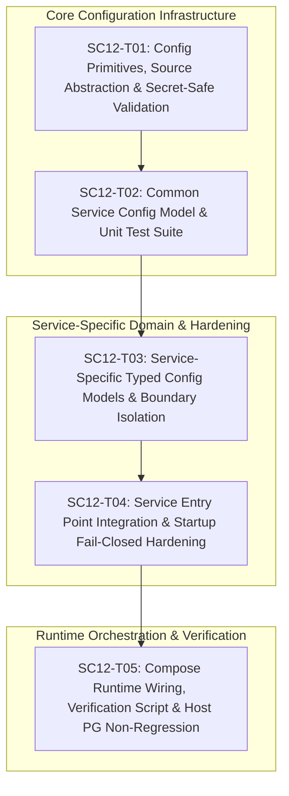

# SC-012 — Establish Service Configuration Foundation

## Executive Summary & Objectives

Card **SC-012** establishes a reusable, deterministic, fail-closed configuration foundation for all five SecureCloud backend services (`gateway`, `auth`, `messaging`, `files`, `audit`) under Milestone **M1: Buildable Distributed Skeleton**.

The configuration foundation provides a strongly typed mechanism for services to obtain, validate, and consume runtime configuration without hardcoding environment-specific values in source code. It operates deterministically in both the local Docker Compose development environment and future container orchestration platforms (Kubernetes).

> [!IMPORTANT]
> SC-012 establishes **configuration infrastructure only**. It strictly excludes business-specific configuration, database connectivity/client pools, domain logic, dynamic configuration servers, and production secret management platforms (Vault/KMS).
>
> **Hard Host Constraint**: The developer workstation operates an independent **PostgreSQL 14** instance on `localhost:5432`. SecureCloud MUST NEVER stop, restart, reconfigure, or bind to host port `5432`. SecureCloud's containerized PostgreSQL 17 binds exclusively to host port `5433` (`127.0.0.1:5433:5432`), while container-to-container traffic uses internal port `postgres:5432`.

---

## Authoritative Architectural Baseline & Version Verification

### 1. PostgreSQL Version Verification
- **SC-011 SecureCloud PostgreSQL Version**: **PostgreSQL 17** (pinned image `postgres:17.0-alpine`).
  - *Authoritative Sources*: `docs/adr/adr-006-persistance-technology-selection.md` (Sections 4, 8, 15), `deploy/compose/docker-compose.yml` (line 135), `specs/phase0/SC-011-tickets.md` (lines 8, 39).
- **Host PostgreSQL Version**: **PostgreSQL 14** (Homebrew service running independently on developer host).
- **Host PostgreSQL Port**: `localhost:5432` (Untouched by SecureCloud).
- **SecureCloud PostgreSQL Host Mapping**: `127.0.0.1:5433:5432` (Host port `5433` -> Container port `5432`).
- **Internal Compose Service Port**: `postgres:5432` (Used by `auth` and `files` services on `securecloud-dev` bridge network).

### 2. Service Ownership Boundaries (ADR-001, ADR-005, ADR-006)
- **Gateway**: Stateless; owns no database or object storage configuration.
- **Auth**: Owns PostgreSQL database `securecloud_auth` (role `auth_user`).
- **Files**: Owns PostgreSQL database `securecloud_files` (role `files_user`) and MinIO S3 bucket `securecloud-files-encrypted` (role `files_minio_user`).
- **Messaging**: Owns ScyllaDB cluster keyspace (CQL port `9042`).
- **Audit**: Owns ClickHouse database `securecloud_audit` (role `audit_user`).

---

## Canonical Environment Variable Specification

### 1. Naming Hierarchy & Precedence Rules
Configuration is resolved using the following deterministic hierarchy:
1. **Service-Specific Canonical Variable** (`SECURECLOUD_<SERVICE>_<SETTING>`)
2. **Global / Transitional Fallback Variable** (`SECURECLOUD_<SETTING>`)
3. **Safe Documented Default** (Applied only if the setting is non-critical / optional)
4. **Fail-Closed Abort** (If the setting is required and unresolvable or malformed)

**Collision & Deprecation Semantics**:
- When both `SECURECLOUD_<SERVICE>_<SETTING>` and `SECURECLOUD_<SETTING>` are present, the service-specific variable has strict precedence.
- If a transitional legacy variable is resolved in place of a canonical variable, the service emits a non-sensitive diagnostic warning:
  `"[SecureCloud] [<service>] NOTICE: Using transitional variable '<VAR>'. Scheduled for deprecation in M2 in favor of '<CANONICAL_VAR>'."`
- Deprecated transitional variables: `SECURECLOUD_GRPC_PORT`, `SECURECLOUD_GRPC_HOST`, `SECURECLOUD_PEER_PROBE_TARGET`, `SECURECLOUD_PEER_PROBE_NAME`.

### 2. Canonical Variable Table

| Variable Name | Owner Service | Variable Presence | Effective Validity Requirement | Default Value | Secret? |
| :--- | :--- | :--- | :--- | :--- | :--- |
| `SECURECLOUD_GRPC_HOST` | Common | Optional | Must resolve to valid IP/hostname | `"0.0.0.0"` | No |
| `SECURECLOUD_GRPC_PORT` | Common | Optional | Must resolve to integer `1..65535` | *(Service standard: 50051..50055)* | No |
| `SECURECLOUD_CA_CERT_PATH` | Common | Optional | Must resolve to non-empty path string | `"/etc/securecloud/certs/ca.crt"` | No |
| `SECURECLOUD_SERVICE_CERT_PATH` | Common | Optional | Must resolve to non-empty path string | `"/etc/securecloud/certs/service.crt"` | No |
| `SECURECLOUD_SERVICE_KEY_PATH` | Common | Optional | Must resolve to non-empty path string | `"/etc/securecloud/certs/service.key"` | No |
| `SECURECLOUD_SHUTDOWN_TIMEOUT_MS`| Common | Optional | Must resolve to positive integer | `5000` | No |
| `SECURECLOUD_GATEWAY_AUTH_ENDPOINT` | Gateway | Optional | Must resolve to valid `host:port` | `"auth:50052"` | No |
| `SECURECLOUD_GATEWAY_MESSAGING_ENDPOINT`| Gateway | Optional | Must resolve to valid `host:port` | `"messaging:50053"` | No |
| `SECURECLOUD_GATEWAY_FILES_ENDPOINT` | Gateway | Optional | Must resolve to valid `host:port` | `"files:50054"` | No |
| `SECURECLOUD_GATEWAY_AUDIT_ENDPOINT` | Gateway | Optional | Must resolve to valid `host:port` | `"audit:50055"` | No |
| `SECURECLOUD_GATEWAY_PEER_PROBE_TARGET` | Gateway | Optional | Valid `host:port` if present | `""` (disabled) | No |
| `SECURECLOUD_GATEWAY_PEER_PROBE_NAME` | Gateway | Optional | Non-empty if probe target set | `""` | No |
| `SECURECLOUD_AUTH_DB_HOST` | Auth | Optional | Must resolve to valid hostname | `"postgres"` | No |
| `SECURECLOUD_AUTH_DB_PORT` | Auth | Optional | Must resolve to integer `1..65535` | `5432` | No |
| `SECURECLOUD_AUTH_DB_NAME` | Auth | Optional | Must resolve to valid DB name | `"securecloud_auth"` | No |
| `SECURECLOUD_AUTH_DB_USER` | Auth | Optional | Must resolve to valid username | `"auth_user"` | No |
| `SECURECLOUD_AUTH_DB_PASSWORD` | Auth | **Mandatory**| Must be non-empty string | *(None; fail closed)* | **YES** |
| `SECURECLOUD_MESSAGING_SCYLLA_HOST` | Messaging | Optional | Must resolve to valid hostname | `"scylladb"` | No |
| `SECURECLOUD_MESSAGING_SCYLLA_PORT` | Messaging | Optional | Must resolve to integer `1..65535` | `9042` | No |
| `SECURECLOUD_MESSAGING_SCYLLA_KEYSPACE`| Messaging | Optional | Must resolve to valid keyspace name | `"securecloud_messaging"` | No |
| `SECURECLOUD_FILES_DB_HOST` | Files | Optional | Must resolve to valid hostname | `"postgres"` | No |
| `SECURECLOUD_FILES_DB_PORT` | Files | Optional | Must resolve to integer `1..65535` | `5432` | No |
| `SECURECLOUD_FILES_DB_NAME` | Files | Optional | Must resolve to valid DB name | `"securecloud_files"` | No |
| `SECURECLOUD_FILES_DB_USER` | Files | Optional | Must resolve to valid username | `"files_user"` | No |
| `SECURECLOUD_FILES_DB_PASSWORD` | Files | **Mandatory**| Must be non-empty string | *(None; fail closed)* | **YES** |
| `SECURECLOUD_FILES_S3_ENDPOINT` | Files | Optional | Must resolve to valid HTTP URL | `"http://minio:9000"` | No |
| `SECURECLOUD_FILES_S3_BUCKET` | Files | Optional | Must resolve to valid bucket name | `"securecloud-files-encrypted"` | No |
| `SECURECLOUD_FILES_S3_ACCESS_KEY` | Files | Optional | Must resolve to valid username | `"files_minio_user"` | No |
| `SECURECLOUD_FILES_S3_SECRET_KEY` | Files | **Mandatory**| Must be non-empty string | *(None; fail closed)* | **YES** |
| `SECURECLOUD_AUDIT_DB_HOST` | Audit | Optional | Must resolve to valid hostname | `"clickhouse"` | No |
| `SECURECLOUD_AUDIT_DB_PORT` | Audit | Optional | Must resolve to integer `1..65535` | `8123` | No |
| `SECURECLOUD_AUDIT_DB_NAME` | Audit | Optional | Must resolve to valid DB name | `"securecloud_audit"` | No |
| `SECURECLOUD_AUDIT_DB_USER` | Audit | Optional | Must resolve to valid username | `"audit_user"` | No |
| `SECURECLOUD_AUDIT_DB_PASSWORD` | Audit | **Mandatory**| Must be non-empty string | *(None; fail closed)* | **YES** |

---

## SecretString Exact Security Semantics

`SecretString` is designed for **best-effort secret handling and accidental disclosure mitigation**.

### 1. What `SecretString` Guarantees
- **Stream Output Masking**: `operator<<(std::ostream&, const SecretString&)` prints `[REDACTED]`.
- **Diagnostic / Error Redaction**: Validation error collectors and exception messages report only setting key names (e.g. `Required configuration 'SECURECLOUD_AUTH_DB_PASSWORD' is missing.`).
- **No Implicit Conversions**: `operator std::string()`, `operator std::string_view()`, and `operator const char*()` are deleted/omitted to prevent accidental coercion into loggers or formatters.
- **Explicit Exposure**: Unredacted secret access requires calling `[[nodiscard]] const std::string& expose_unredacted_secret() const noexcept;`.
- **Best-Effort Zeroization**: Destructor invokes `explicit_bzero()` (or volatile memory wipe on platforms lacking it) over the internal buffer before deallocation.

### 2. What `SecretString` Does NOT Guarantee
- Does not protect against memory dumps, attached debuggers (`gdb`/`lldb`), OS swap, or kernel-level memory introspection.
- Does not guarantee zeroization of transient copies generated during SSO (Small String Optimization) or standard library string reallocations.

---

## Ticket Decomposition

### SC12-T01 — Configuration Primitives, Source Abstraction & Secret-Safe Validation

- **Objective**: Implement the core configuration types in `src/common/configuration/`: the `ConfigurationSource` abstraction (`ProcessEnvironmentSource`, `InMemoryConfigurationSource`), typed parsing utilities (`ConfigParser`), `SecretString`, and structured fail-closed validation error diagnostics (`ValidationError`, `ValidationResult`).
- **Exact files**:
  - `[NEW] src/common/include/securecloud/configuration/configuration_source.hpp`
  - `[NEW] src/common/include/securecloud/configuration/config_parser.hpp`
  - `[NEW] src/common/include/securecloud/configuration/validation_error.hpp`
  - `[NEW] src/common/include/securecloud/configuration/secret_string.hpp`
  - `[NEW] src/common/src/configuration/configuration_source.cpp`
  - `[NEW] src/common/src/configuration/config_parser.cpp`
  - `[NEW] src/common/src/configuration/validation_error.cpp`
  - `[NEW] src/common/src/configuration/secret_string.cpp`
  - `[MODIFY] src/common/CMakeLists.txt`
- **Dependencies**: None (builds upon `securecloud_common`).
- **Implementation approach**:
  - Implement `ConfigurationSource` pure virtual interface: `virtual std::optional<std::string> get(std::string_view key) const = 0;`.
  - Implement `ProcessEnvironmentSource`: safely converts `std::string_view key` to a null-terminated `std::string` before calling `std::getenv(key_str.c_str())`.
  - Implement `InMemoryConfigurationSource`: backed by `std::unordered_map<std::string, std::string>` for deterministic, parallel-safe testing without mutating host process environment.
  - Implement `SecretString` with explicit `.expose_unredacted_secret()` accessor, `operator<<` streaming `[REDACTED]`, and destructor memory wiping.
  - Implement `ConfigParser` with static parsing methods: `parse_uint16`, `parse_bool`, `parse_duration_ms`, `parse_path`, and `parse_string`.
- **TDD Tests**:
  - `tests/unit/configuration/config_parser_test.cpp`:
    - Port parsing: valid bounds (`1..65535`), rejects 0, 65536, negative, and non-numeric strings.
    - Boolean parsing: accepts `"true"`, `"false"`, `"1"`, `"0"` (case-insensitive); rejects `"yes"`, `"enable"`, `"foo"`.
    - Duration parsing: accepts millisecond integers within specified minimum/maximum bounds.
    - Path parsing: validates non-empty strings and normalizes paths.
    - SecretString tests: verifies `operator<<` streams `[REDACTED]`, `.expose_unredacted_secret()` returns correct payload, and no implicit conversions exist.
- **Security considerations**:
  - Eliminates secret leakage in diagnostics and logs.
  - Guarantees null-termination safety when interfacing with C `getenv`.
- **Acceptance criteria**:
  - All parser primitives reject malformed input with structured `ValidationError`.
  - `SecretString` masks values in streams and formatting.
  - `InMemoryConfigurationSource` passes unit tests without reading or mutating host environment.
- **Explicit out-of-scope**: File-based parsing (YAML/JSON), dynamic runtime reload.

---

### SC12-T02 — Common Service Configuration Model & Comprehensive Unit Test Suite

- **Objective**: Establish the `CommonServiceConfig` model representing runtime parameters shared across all five SecureCloud microservices (service identity, gRPC listen address and port, mTLS credential paths, shutdown timeout), along with comprehensive GoogleTest unit test coverage.
- **Exact files**:
  - `[NEW] src/common/include/securecloud/configuration/common_service_config.hpp`
  - `[NEW] src/common/src/configuration/common_service_config.cpp`
  - `[NEW] tests/unit/configuration/config_parser_test.cpp`
  - `[NEW] tests/unit/configuration/common_service_config_test.cpp`
  - `[MODIFY] tests/unit/CMakeLists.txt`
  - `[MODIFY] src/common/CMakeLists.txt`
- **Dependencies**: SC12-T01.
- **Implementation approach**:
  - Define `CommonServiceConfig`:
    - `std::string service_name`
    - `std::string service_display_name`
    - `std::string grpc_host` (default `"0.0.0.0"`)
    - `uint16_t grpc_port`
    - `securecloud::common::security::SecurityCredentialsConfig tls_credentials` (integrating directly with SC-009/SC-010 mTLS infrastructure)
    - `std::chrono::milliseconds shutdown_timeout` (default `5000ms`)
  - Implement `CommonServiceConfig::load()` with precedence: service override (`SECURECLOUD_<SERVICE>_GRPC_PORT`) > fallback (`SECURECLOUD_GRPC_PORT`) > default.
  - Effective validity: fails closed if port is out of range or certificate paths resolve to empty strings.
- **TDD Tests**:
  - `tests/unit/configuration/common_service_config_test.cpp`:
    - Successful load with default values.
    - Override precedence: service override takes priority over general fallback.
    - Transitional fallback: verifies legacy variable resolution and warning emission.
    - Fail-closed validation: out-of-bounds port (`70000`), negative port, empty cert path.
    - 100% test isolation using `InMemoryConfigurationSource`.
- **Security considerations**:
  - Mandatory mTLS credential path validation at startup before gRPC server initialization.
- **Acceptance criteria**:
  - Clean integration with existing `SecurityCredentialsConfig`.
  - Invalid configuration halts startup with structured, secret-safe errors.
  - All unit tests pass with zero host environment modifications.
- **Explicit out-of-scope**: Service-specific persistence models.

---

### SC12-T03 — Service-Specific Typed Configuration Models & Boundary Isolation

- **Objective**: Establish isolated, typed configuration models for each of the five backend services (`GatewayConfig`, `AuthConfig`, `MessagingConfig`, `FilesConfig`, `AuditConfig`), ensuring each model exposes only the configuration fields within its architectural domain (ADR-001, ADR-005).
- **Exact files**:
  - `[NEW] src/gateway/gateway_config.hpp` and `src/gateway/gateway_config.cpp`
  - `[NEW] src/auth/auth_config.hpp` and `src/auth/auth_config.cpp`
  - `[NEW] src/messaging/messaging_config.hpp` and `src/messaging/messaging_config.cpp`
  - `[NEW] src/files/files_config.hpp` and `src/files/files_config.cpp`
  - `[NEW] src/audit/audit_config.hpp` and `src/audit/audit_config.cpp`
  - `[NEW] tests/unit/configuration/service_config_boundaries_test.cpp`
  - `[MODIFY] src/gateway/CMakeLists.txt`
  - `[MODIFY] src/auth/CMakeLists.txt`
  - `[MODIFY] src/messaging/CMakeLists.txt`
  - `[MODIFY] src/files/CMakeLists.txt`
  - `[MODIFY] src/audit/CMakeLists.txt`
  - `[MODIFY] tests/unit/CMakeLists.txt`
- **Dependencies**: SC12-T01, SC12-T02.
- **Implementation approach**:
  - `GatewayConfig`: `CommonServiceConfig`, downstream gRPC endpoints (`auth`, `messaging`, `files`, `audit`), peer probe settings. Zero database fields.
  - `AuthConfig`: `CommonServiceConfig`, PostgreSQL settings (`db_host`, `db_port`, `db_name`, `db_user`, `SecretString db_password`). Zero Files/Messaging/Audit fields.
  - `MessagingConfig`: `CommonServiceConfig`, ScyllaDB settings (`scylla_host`, `scylla_port`, `scylla_keyspace`). Zero Auth/Files/Audit fields.
  - `FilesConfig`: `CommonServiceConfig`, PostgreSQL settings (`db_host`, `db_port`, `db_name`, `db_user`, `SecretString db_password`), MinIO S3 settings (`s3_endpoint`, `s3_bucket`, `s3_access_key`, `SecretString s3_secret_key`). Zero Messaging/Audit fields.
  - `AuditConfig`: `CommonServiceConfig`, ClickHouse settings (`db_host`, `db_port`, `db_name`, `db_user`, `SecretString db_password`). Zero Auth/Messaging/Files fields.
- **TDD Tests**:
  - `tests/unit/configuration/service_config_boundaries_test.cpp`:
    - API / Member-Access checks: verifies intended fields exist and forbidden fields do not exist on the respective configuration types.
    - Include isolation: verifies service configuration headers remain private to their respective service directories and are not part of `src/common/include/`.
    - Runtime isolation: verifies that passing another service's variables to a loader results in those variables being completely ignored.
    - Required field validation: verifies `AuthConfig`, `FilesConfig`, and `AuditConfig` fail closed if required passwords/keys are absent.
- **Security considerations**:
  - Strict least-privilege boundary enforcement across service configuration models.
  - Sensitive credentials stored strictly as `SecretString`.
- **Acceptance criteria**:
  - Each service configuration model exposes only the fields belonging to its architectural ownership boundary.
  - Missing mandatory credentials produce fail-closed errors without leaking secret values.
- **Explicit out-of-scope**: Establishing actual database connection pools or client sessions.

---

### SC12-T04 — Service Entry Point Integration & Startup Fail-Closed Hardening

- **Objective**: Refactor all five service `main.cpp` entry points to eliminate ad-hoc `get_env_or_default` copy-paste, integrate typed service configuration loaders at startup, fail closed with exit code `1` upon invalid or missing configuration before any network socket or server allocation, and pass validated settings to gRPC server builders.
- **Exact files**:
  - `[MODIFY] src/gateway/main.cpp`
  - `[MODIFY] src/auth/main.cpp`
  - `[MODIFY] src/messaging/main.cpp`
  - `[MODIFY] src/files/main.cpp`
  - `[MODIFY] src/audit/main.cpp`
- **Dependencies**: SC12-T01, SC12-T02, SC12-T03.
- **Implementation approach**:
  - In each `main.cpp`:
    1. Remove `get_env_or_default`.
    2. Instantiate `ProcessEnvironmentSource env_source;`.
    3. Invoke `<Service>Config::load(env_source, errors)`.
    4. If validation errors exist:
       - Print secret-safe diagnostic to `std::cerr`:
         ```text
         [SecureCloud] [<service>] FATAL: Configuration validation failed:
           - <setting_key>: <error_message>
         ```
       - Return exit code `1` immediately before any socket or gRPC initialization.
    5. Pass validated `config.common.tls_credentials` to `MtlsCredentialLoader::create_server_credentials()`.
    6. Bind `grpc::ServerBuilder` to `config.common.listen_address()` (`host:port`).
    7. In `gateway`, pass validated typed peer probe settings.
    8. Retain existing signal handling, poll loops, and mTLS shutdown behavior.
- **Tests**:
  - Regression verification using existing `MtlsIntegrationTest`.
  - Empirical verification that invalid environment variables cause clean exit with code `1`.
- **Security considerations**:
  - Zero services enter a listening or partially initialized state when misconfigured.
  - Diagnostics logged to `std::cerr` contain zero credential payloads.
- **Acceptance criteria**:
  - Ad-hoc `get_env_or_default` deleted from all five `main.cpp` entry points.
  - Invalid configuration halts startup with exit code `1`.
  - Valid configuration boots the gRPC mTLS server exactly as expected.
- **Explicit out-of-scope**: Implementing business logic or database queries in `main.cpp`.

---

### SC12-T05 — Docker Compose Runtime Wiring, Automated Verification Script & Host PostgreSQL Non-Regression

- **Objective**: Update `deploy/compose/docker-compose.yml` to wire canonical environment variables into the 5 application service containers, update `deploy/compose/.env.example`, implement an automated verification script (`scripts/verify-service-config.sh`), and empirically verify non-regression of the host PostgreSQL 14 instance on `localhost:5432`.
- **Exact files**:
  - `[MODIFY] deploy/compose/docker-compose.yml`
  - `[MODIFY] deploy/compose/.env.example`
  - `[NEW] scripts/verify-service-config.sh`
  - `[MODIFY] specs/phase0/SC-012-tickets.md`
- **Dependencies**: SC12-T01, SC12-T02, SC12-T03, SC12-T04.
- **Implementation approach**:
  - In `deploy/compose/docker-compose.yml`:
    - Add `environment:` sections for `gateway`, `auth`, `messaging`, `files`, and `audit` declaring canonical `SECURECLOUD_` variables.
    - Wire database credentials from SC-011 (e.g. `SECURECLOUD_AUTH_DB_HOST: postgres`, `SECURECLOUD_AUTH_DB_PORT: "5432"`, `SECURECLOUD_AUTH_DB_PASSWORD: ${AUTH_DB_PASSWORD:-auth_dev_db_secret}`).
    - Preserve all SC-011 persistence containers, host mappings (`5433:5432`), volumes, and healthchecks untouched.
  - In `deploy/compose/.env.example`:
    - Document canonical service configuration variables.
  - In `scripts/verify-service-config.sh`, implement 10 automated empirical checks:
    1. **Host PostgreSQL Initial State Check**: Verify host PostgreSQL 14 is accepting connections on `localhost:5432` prior to Compose startup (via `/opt/homebrew/bin/pg_isready -h localhost -p 5432` or TCP socket check).
    2. **Compose File Syntax**: Validate Compose syntax (`docker compose config`).
    3. **Configuration Unit Tests**: Run CTest configuration unit tests (`config_parser_test`, `common_service_config_test`, `service_config_boundaries_test`).
    4. **Negative Fail-Closed Test (Malformed Port)**: Run ephemeral container with `SECURECLOUD_GRPC_PORT=99999`; verify it exits with code `1` and logs validation failure.
    5. **Negative Fail-Closed Test (Missing Required Credential)**: Run ephemeral `auth` container with `SECURECLOUD_AUTH_DB_PASSWORD=""`; verify it exits with code `1`.
    6. **Positive Stack Lifecycle & Health**: Bring up Compose stack; verify all Compose services defined by the SC-011 persistence topology reach `healthy` status.
    7. **SecureCloud PostgreSQL Host Port Check**: Verify SecureCloud PostgreSQL is accessible at `localhost:5433` (NOT 5432).
    8. **Host PostgreSQL Running State Non-Regression**: Verify host PostgreSQL 14 continues accepting connections on `localhost:5432` while SecureCloud is running.
    9. **Secret Leak Inspection**: Scan container logs across all 5 services to confirm zero passwords or private keys appear in stdout/stderr.
    10. **Host PostgreSQL Post-Shutdown Non-Regression**: Stop SecureCloud containers; verify host PostgreSQL 14 remains active on `localhost:5432`.
- **Tests**: Full automated execution via `./scripts/verify-service-config.sh`.
- **Security considerations**:
  - Empirical verification that host PostgreSQL 14 remains active and untouched throughout.
  - Empirical proof of fail-closed container behavior and secret-free log streams.
- **Acceptance criteria**:
  - `./scripts/verify-service-config.sh` passes all 10 checks with code `0`.
  - Host PostgreSQL 14 is empirically verified active before, during, and after Compose execution.
  - 100% pass rate across full CTest suite (existing 23 tests + new configuration tests) and `./scripts/check-formatting.sh`.
- **Explicit out-of-scope**: Modifying host PostgreSQL configuration or data directories.

---

## Dependency Graph



Implementation order is strictly sequential: `T01 → T02 → T03 → T04 → T05`.

---

## PostgreSQL Isolation & Verification Invariants

```text
==============================================================================
DEVELOPER WORKSTATION (macOS Host)
==============================================================================

  ┌────────────────────────────────────────────────────────┐
  │ Host PostgreSQL 14 (Homebrew Service)                 │
  │ Listening on: localhost:5432                           │
  │ Status: MUST REMAIN UNTOUCHED AND CONSTANTLY RUNNING   │
  └────────────────────────────────────────────────────────┘

==============================================================================
DOCKER COMPOSE RUNTIME ENVIRONMENT
==============================================================================

  ┌────────────────────────────────────────────────────────┐
  │ SecureCloud PostgreSQL 17 Container (securecloud-postgres-1)
  │ Container Internal Port: 5432                          │
  │ Host Loopback Port Binding: 127.0.0.1:5433:5432        │
  │ Dedicated Named Volume: postgres-data                  │
  └────────────────────────────────────────────────────────┘
          ▲                                ▲
          │ internal: 5432                 │ internal: 5432
          │                                │
  ┌───────┴───────────────┐        ┌───────┴───────────────┐
  │ auth container        │        │ files container       │
  │ (auth_user)           │        │ (files_user)          │
  └───────────────────────┘        └───────────────────────┘
```

- **Architectural Isolation**: Guaranteed by Docker network namespaces and independent host port mappings (`5433:5432` vs `localhost:5432`).
- **Empirical Non-Regression**: Verified by automated socket/pg_isready polling across Compose start, run, and stop cycles.
