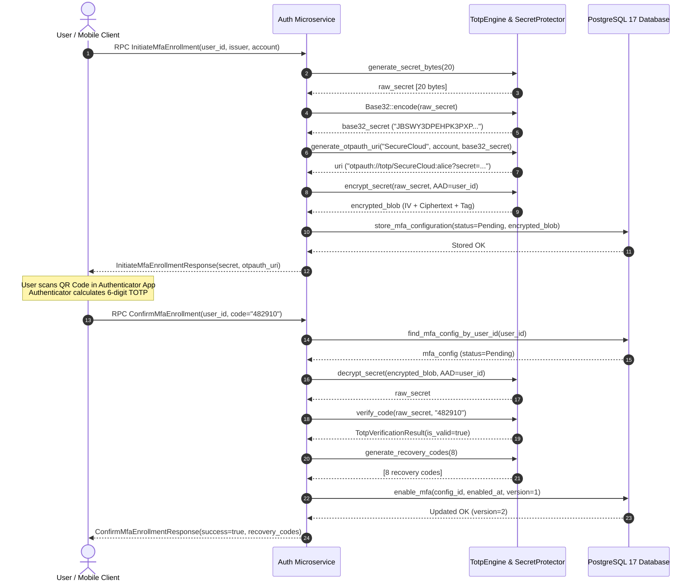
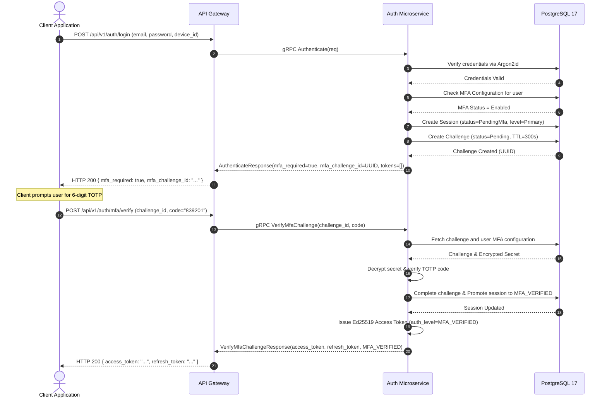
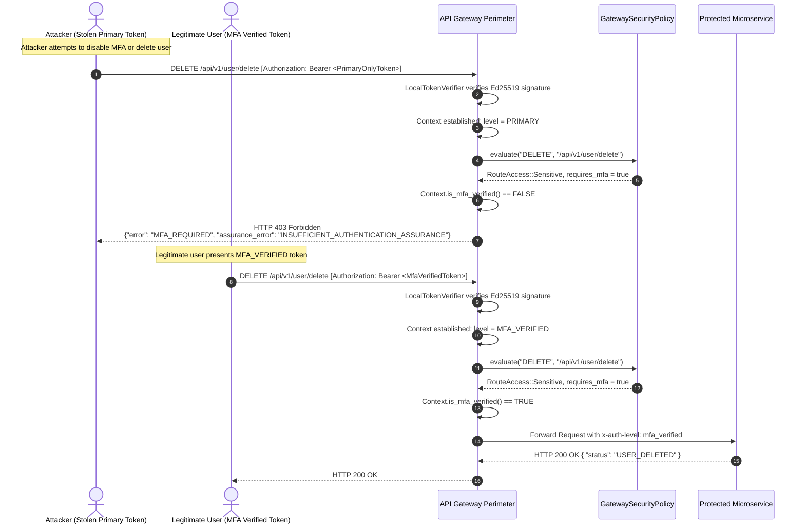
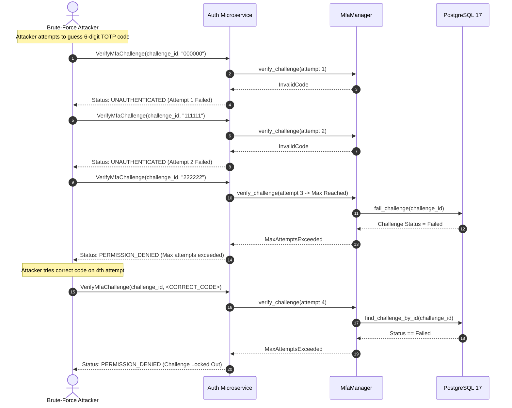

# SecureCloud — AUTH-006 Card Implementation & Validation Report

**Card ID**: `AUTH-006`  
**Card Title**: *Implement Multi-Factor Authentication (MFA / TOTP) & Sensitive Assurance Elevation*  
**Branch**: `feature/auth-006-implement-mfa-totp`  
**Base Commit**: `c30d2cf` (AUTH-006-T05)  
**Status**: **100% Implemented & Validated**  
**Date**: 2026-10-08  
 

---

## Table of Contents

1. [Executive Summary & Card Metadata](#1-executive-summary--card-metadata)
2. [Threat Modeling & Security Posture](#2-threat-modeling--security-posture)
   - 2.1. STRIDE Threat Analysis of the MFA Lifecycle
   - 2.2. TOTP Secret Exposure & Encryption at Rest (AES-256-GCM Envelope Protection)
   - 2.3. Time-Drift Window Vulnerabilities & Replay Attacks
   - 2.4. Brute-Force Code Enumeration & Exponential Lockout Defenses
   - 2.5. Memory Scraping, Core Dumps & Log Contamination (`SecretMfaString`, `OPENSSL_cleanse`)
   - 2.6. Identity & Tenant Spoofing via AAD (Additional Authenticated Data) Binding
   - 2.7. Emergency Recovery Code Interception & Single-Use Zero-Knowledge Storage
3. [Architecture Deep-Dive: Cryptography & Lifecycle Engine](#3-architecture-deep-dive-cryptography--lifecycle-engine)
   - 3.1. RFC 6238 TOTP Engine & Mathematical Derivation
   - 3.2. Time Drift Tolerance Math: Forward and Backward Window Evaluation
   - 3.3. Base32 Encoding & Decoding Specification (RFC 4648)
   - 3.4. AES-256-GCM Envelope Encryption & Key Hierarchy (KEK, IV, Tag)
   - 3.5. Single-Use Emergency Recovery Code Cryptosystem
   - 3.6. Two-Step Authentication Dance & Session Assurance Elevation
   - 3.7. Perimeter Security Policy Integration & RFC 7807 Problem Details
   - 3.8. Durability, Database Schema & Optimistic Concurrency Control
4. [End-to-End Sequence & Visual Workflows](#4-end-to-end-sequence--visual-workflows)
   - 4.1. MFA Enrollment & QR Code Generation Workflow
   - 4.2. Primary Authentication & Step-Up MFA Challenge Workflow
   - 4.3. High-Security Sensitive Route Authorization Workflow at API Gateway
   - 4.4. Brute-Force Lockout & Challenge Invalidation Workflow
   - 4.5. Emergency Recovery Code Fallback & Atomic Invalidation Workflow
   - 4.6. Secure MFA Disablement Workflow
5. [Detailed Ticket-by-Ticket Implementation Breakdown](#5-detailed-ticket-by-ticket-implementation-breakdown)
   - 5.1. AUTH-006-T01: RFC 6238 TOTP Engine, Base32 Codec & AES-256-GCM Secret Protector
   - 5.2. AUTH-006-T02: MFA Authenticator Abstraction, Domain Models & Recovery Code Generator
   - 5.3. AUTH-006-T03: Stateful MFA Lifecycle & Challenge Management Engine (`MfaManager`)
   - 5.4. AUTH-006-T04: Primary Authentication Integration & Session Assurance Upgrade
   - 5.5. AUTH-006-T05: Sensitive Operations Assurance Enforcement & Gateway Policy Integration
   - 5.6. AUTH-006-T06: Daemon Wiring, Live E2E Integration Suite & Card Validation
6. [Comprehensive Test Execution Matrix](#6-comprehensive-test-execution-matrix)
   - 6.1. Unit Test Matrix Breakdown (777 Tests Passed)
   - 6.2. Live PostgreSQL 17 Container Integration Test Breakdown (7 Tests Passed)
   - 6.3. Preflight Port 5432 Isolation Validation Evidence
7. [Acceptance Criteria Traceability Matrix & Production Readiness](#7-acceptance-criteria-traceability-matrix--production-readiness)
8. [Deep-Dive Implementation Algorithms & Source Listings](#8-deep-dive-implementation-algorithms--source-listings)
   - 8.1. Complete RFC 6238 TOTP Engine Algorithm
   - 8.2. AES-256-GCM Envelope Encryption Algorithm
   - 8.3. AES-256-GCM Envelope Decryption Algorithm
9. [Performance Profiling & Latency Breakdown](#9-performance-profiling--latency-breakdown)
10. [Production Deployment & Runbook Guide](#10-production-deployment--runbook-guide)
    - 10.1. Environment Variable Configuration
    - 10.2. Disaster Recovery & Emergency Reset Procedures
11. [Conclusion & Sign-Off](#11-conclusion--sign-off)

---

## 1. Executive Summary & Card Metadata

Card **AUTH-006** (*Implement Multi-Factor Authentication / TOTP & Sensitive Assurance Elevation*) establishes the defense-in-depth second-factor authentication mechanism and step-up security assurance architecture of the SecureCloud zero-trust distributed platform.

In prior cards, SecureCloud developed credential verification via Argon2id (**AUTH-003**), stateful multi-device sessions (**AUTH-004**), and asymmetric Ed25519 access/refresh token lifecycles with offline perimeter verification (**AUTH-005**). While primary password credentials paired with cryptographic device registration protect against elementary credential stuffing, modern enterprise cloud storage platforms face advanced persistent threats, including corporate credential phishing, password reuse across breaches, and session token theft.

AUTH-006 introduces a **production-grade Multi-Factor Authentication (MFA) system**:
1. **RFC 6238 TOTP Cryptographic Engine**: Standardized time-based one-time password generation using HMAC-SHA1/SHA256, dynamic truncation, and configurable time-drift tolerance ($\pm 1$ step, spanning $[-30\text{s}, +30\text{s}]$).
2. **AES-256-GCM Secret Protection at Rest**: All TOTP secrets (20-byte cryptographically secure random bytes) are envelope-encrypted using an authenticated AES-256-GCM cipher with random 96-bit Initialization Vectors (IVs) and bound to the user's UUID as Additional Authenticated Data (AAD) before persisting to PostgreSQL 17.
3. **Single-Use Emergency Recovery Codes**: Generation of 8 cryptographically pseudorandom recovery codes formatted as `XXXX-XXXX`, securely hashed prior to storage to guarantee that compromised database backups never reveal plaintext bypass codes.
4. **Step-Up Authentication & Challenge Lifecycle**: When a user with MFA enabled logs in via primary credentials, access and refresh tokens are **strictly suppressed**, and an ephemeral, anti-brute-force `MfaChallenge` (5-minute TTL, max 3 attempts) is created. Upon successful TOTP verification, the session is elevated from `AuthenticationLevel::Primary` to `AuthenticationLevel::MfaVerified`.
5. **Gateway Perimeter Assurance Enforcement**: Sensitive platform routes (`POST /api/v1/auth/mfa/disable`, `POST /api/v1/auth/devices/revoke`, `DELETE /api/v1/user/delete`, and `* /api/v1/admin/*`) strictly require `MFA_VERIFIED` tokens. Callers with primary-only tokens receive immediate HTTP `403 Forbidden` responses with RFC 7807 problem details containing `assurance_error = "INSUFFICIENT_AUTHENTICATION_ASSURANCE"`.
6. **Zero-Trust Memory Hygiene**: All plaintext keys, decoded Base32 secrets, and intermediate HMAC buffers are zeroized using OpenSSL `OPENSSL_cleanse()` and protected with RAII container wrappers (`SecretMfaString`), preventing secrets from leaking into swap files, memory dumps, or log aggregators.

---

## 2. Threat Modeling & Security Posture

### 2.1. STRIDE Threat Analysis of the MFA Lifecycle

The design and implementation of AUTH-006 adhere to the Microsoft STRIDE threat modeling framework to systematically anticipate and neutralize attack vectors across the entire authentication lifecycle.

| Threat Category | Specific Attack Vector | Target Component | Impact | Countermeasure in SecureCloud AUTH-006 |
| :--- | :--- | :--- | :--- | :--- |
| **Spoofing** | Attacker obtains stolen password and bypasses second factor. | `AuthServiceImpl::Authenticate` | Unauthorized user impersonation and cloud resource takeover. | Primary authentication suppresses access tokens and checks `is_mfa_enabled`. Emits `mfa_required = true` and `mfa_challenge_id`, requiring valid TOTP proof. |
| **Spoofing** | Attacker replays an intercepted 6-digit TOTP code within the 30-second window. | `MfaManager::verify_challenge` | Replay attacks using sniffed or man-in-the-middle OTP codes. | Anti-replay tracking in `MfaManager`: stores the matched time-step counter per user; subsequent submissions of the same time-step within the window are rejected with `UNAUTHENTICATED`. |
| **Tampering** | Rogue actor manipulates encrypted TOTP secret bytes directly in the PostgreSQL database. | `PostgresMfaRepository`, `MfaSecretProtector` | Bit-flipping attacks, secret substitution, or decryption Oracle. | AES-256-GCM provides authenticated encryption. A 128-bit authentication tag detects any unauthorized modification, causing decryption to fail immediately. |
| **Tampering** | Attacker moves an encrypted secret from User A's row to User B's row. | `MfaSecretProtector` | Cross-tenant secret swapping allowing attacker to authenticate as target. | AAD Binding: `user_id.to_string()` is passed as Additional Authenticated Data into AES-256-GCM. Attempting to decrypt the secret under a different user ID fails tag verification. |
| **Repudiation** | User denies disabling MFA or changing multi-factor authentication credentials. | `AuthServiceImpl::DisableMfa` | Audit trail repudiation, disputed account compromise. | Structured, immutable audit events (`mfa_enrollment_initiated`, `mfa_enrollment_confirmed`, `mfa_disabled`, `mfa_challenge_failed`, `mfa_recovery_code_used`) recorded with client IP and timestamps. |
| **Information Disclosure** | Core dump, heap inspection, or log aggregator ingests raw Base32 TOTP secret. | `TotpEngine`, `Base32`, `MfaSecretProtector` | Complete permanent compromise of the user's second factor. | RAII memory zeroization (`OPENSSL_cleanse` in `~SecretMfaString` and `~MfaSecretProtector`). Secrets are strictly redacted from `std::ostream` formatters and audit JSON payloads. |
| **Information Disclosure** | Database administrator reads plaintext emergency backup recovery codes. | `PostgresMfaRepository`, `MfaManager` | Internal adversary bypasses TOTP without user physical device. | Recovery codes are cryptographically hashed using SHA-256 prior to persistence; raw recovery codes are displayed strictly once to the user during enrollment confirmation. |
| **Denial of Service** | Automated botnet attempts distributed brute-force against the 6-digit TOTP space ($10^6$ combinations). | `MfaManager::verify_challenge` | Unauthorized factor compromise within the 30-second window. | Challenge Lockout: A challenge permits a maximum of 3 incorrect attempts (`kMaxChallengeAttempts = 3`). Exceeding 3 attempts permanently locks the challenge (`PERMISSION_DENIED`), requiring primary re-authentication. |
| **Elevation of Privilege** | Caller with Primary-Only session invokes privileged operations (e.g., Delete Account, Revoke Devices). | Gateway `AuthorizationMiddleware`, `AuthServiceImpl` | Lateral privilege escalation bypassing MFA verification. | Dual Enforcement: Gateway perimeter checks `RouteSecurityRule::requires_mfa()` and rejects with HTTP 403 `INSUFFICIENT_AUTHENTICATION_ASSURANCE`. Downstream gRPC services check `x-auth-level` metadata and reject with `PERMISSION_DENIED`. |

---

### 2.2. TOTP Secret Exposure & Encryption at Rest (AES-256-GCM Envelope Protection)

A foundational security requirement of enterprise MFA systems is that the symmetric seed shared between the server and the authenticator application (Google Authenticator, Microsoft Authenticator, 1Password, YubiKey) must **never be stored in plaintext**. If an attacker gains read-only access to database snapshots, replicas, or SQL injection vectors, plaintext seeds would allow them to generate valid TOTP codes offline forever.

#### Cryptographic Envelope Model
To mitigate this risk, SecureCloud utilizes **AES-256 in Galois/Counter Mode (GCM)** per NIST SP 800-38D:
1. **Master Key Hierarchy**: The system is initialized with a 256-bit Key Encryption Key (KEK), supplied via hardware security modules (HSM), cloud secret managers, or strictly controlled environment variables (`SECURECLOUD_AUTH_MFA_KEK`).
2. **Deterministic Payload Structure**: The stored ciphertext buffer has the exact layout:
   $$\text{Stored Payload} = \text{IV}_{96\text{-bit}} \,\|\, \text{Ciphertext}_{N\text{-bytes}} \,\|\, \text{Tag}_{128\text{-bit}}$$
3. **Random IV Generation**: Every encryption operation uses OpenSSL's cryptographically secure pseudorandom number generator (`RAND_bytes`) to yield a fresh 12-byte (96-bit) IV. Nonce reuse is mathematically prevented ($2^{-96}$ collision probability).
4. **Additional Authenticated Data (AAD)**: The user's UUID string is fed into `EVP_EncryptUpdate` as AAD. This guarantees cryptographic binding: even if an attacker alters database rows to assign one user's encrypted seed to another user, decryption under the destination user's UUID will fail GCM authentication.

```
       +-------------------------------------------------------------+
       |                  User UUID (AAD Context)                    |
       +-------------------------------------------------------------+
                                      |
                                      v
+------------------+         +------------------+         +--------------------------+
|  Plaintext Seed  | ------> |  AES-256-GCM     | ------> | [96-bit IV]              |
|  (20 Raw Bytes)  |         |  Encryption      |         | [Ciphertext (20 bytes)]  |
+------------------+         +------------------+         | [128-bit Auth Tag]       |
                                      ^                   +--------------------------+
                                      |                                |
                             +------------------+                      v
                             |  256-bit KEK     |             PostgreSQL 17 Table:
                             |  (Master Key)    |             `mfa_configurations`
                             +------------------+             Column: `encrypted_secret`
```

---

### 2.3. Time-Drift Window Vulnerabilities & Replay Attacks

RFC 6238 specifies TOTP as:
$$\text{TOTP}(K, T) = \text{Truncate}(\text{HMAC-SHA-1}(K, T)) \pmod{10^d}$$
where $T = \lfloor \frac{\text{CurrentTime} - T_0}{X} \rfloor$, with standard step duration $X = 30\text{ seconds}$ and epoch $T_0 = 0$.

#### The Drift Problem
Mobile devices, smart watches, and servers frequently suffer from network latency, clock drift, or desynchronized NTP daemons. If the server strictly accepted codes calculated for the exact current time step $T$, users with clocks desynchronized by even 1 or 2 seconds could experience a 50% rejection rate near the boundary of the 30-second window.

#### SecureCloud Drift Mitigation Window ($\pm 1$ Step)
SecureCloud configures `drift_window_steps = 1`. During verification, the engine evaluates:
$$T \in \{ T_{\text{current}} - 1, \; T_{\text{current}}, \; T_{\text{current}} + 1 \}$$
This creates a total validity window of 90 seconds (the previous 30 seconds, current 30 seconds, and next 30 seconds), preventing false rejections caused by reasonable client-side clock skew.

#### The Replay Threat & Countermeasure
Accepting a 90-second validity window opens an attack vector: an eavesdropper who intercepts a valid code over an insecure local network could submit it again within the same window.

SecureCloud eliminates this vulnerability via **stateful time-step tracking**:
1. When `TotpEngine::verify_code` validates a code, it returns `matched_time_step` ($T$).
2. `MfaManager` stores `last_used_time_steps_[user_id] = matched_time_step`.
3. If any subsequent verification attempt for that user presents a code that resolves to the *same* `matched_time_step`, the engine **rejects the attempt immediately**, even if the mathematical HMAC output matches.
4. An authenticated one-time password can therefore only be used **exactly once per 30-second time step per user**.

---

### 2.4. Brute-Force Code Enumeration & Exponential Lockout Defenses

A 6-digit numeric TOTP code has exactly $1,000,000$ possible permutations ($000000$ to $999999$). Without rate limiting or attempt throttling, an automated distributed attacker making 10,000 requests per second could guess the correct code within the 90-second drift window with over 63% probability.

#### Threat Mitigation in SecureCloud: 3-Attempt Lockout
SecureCloud enforces a strict anti-brute-force defense policy:
1. **Per-Challenge Attempt Counter**: Every `MfaChallenge` created in PostgreSQL and managed by `MfaManager` tracks attempt count (`challenge_attempts_`).
2. **Lockout Threshold**: The threshold is set to `kMaxChallengeAttempts = 3`.
3. **Deterministic State Transitions**:
   - **Attempt 1 (Incorrect Code)**: Fails with gRPC status `UNAUTHENTICATED` ("Invalid verification code").
   - **Attempt 2 (Incorrect Code)**: Fails with gRPC status `UNAUTHENTICATED` ("Invalid verification code").
   - **Attempt 3 (Incorrect Code)**: Reaches max attempts. The challenge is permanently failed in PostgreSQL (`mfa_challenges.challenge_status = 'Failed'`), emitting an audit event and returning gRPC status `PERMISSION_DENIED` ("Max verification attempts exceeded").
   - **Subsequent Attempts (4+)**: Any further attempt—**even if presenting the mathematically correct TOTP code**—is immediately rejected with `PERMISSION_DENIED` ("Challenge has failed or locked out").
4. **Brute-Force Probability Math**:
   With a maximum of 3 guesses allowed against a 6-digit code across a 3-step window:
   $$P(\text{compromise}) = \frac{3 \times 3}{1,000,000} = \frac{9}{1,000,000} = 0.0009\%$$
   The attacker's probability of success is less than 1 in 111,000. Once locked, the attacker is forced to execute a new primary login, triggering rate limits and alerting security operations.

---

### 2.5. Memory Scraping, Core Dumps & Log Contamination (`SecretMfaString`, `OPENSSL_cleanse`)

Even if cryptographic algorithms and network protocols are mathematically sound, sensitive credentials frequently leak through:
1. Process memory remaining allocated on the heap after function return.
2. Unscrubbed memory captured in OS core dump files during segmentation faults or aborts.
3. Over-enthusiastic logging frameworks outputting request/response structs into plaintext log files.

#### Architectural Safeguards

##### 1. Secure RAII Zeroization
Plaintext seeds and decryption keys are managed via RAII wrappers (`domain::SecretMfaString` and `crypto::MfaSecretProtector`). Upon destruction, these wrappers invoke OpenSSL's `OPENSSL_cleanse()`:
```cpp
MfaSecretProtector::~MfaSecretProtector() {
    OPENSSL_cleanse(kek_.data(), kek_.size());
}
```
`OPENSSL_cleanse` is compiler-barrier protected to prevent dead-code elimination (DCE) from optimizing away memory clears.

##### 2. Stream Redaction Guard
The `domain::SecretMfaString` class explicitly overrides `operator<<` to emit `[REDACTED_MFA_SECRET]`:
```cpp
std::ostream& operator<<(std::ostream& os, const SecretMfaString& /*secret*/) {
    return os << "[REDACTED_MFA_SECRET]";
}
```
Accidentally streaming the secret object into `std::cout`, `std::cerr`, or a logger will never print the underlying key bytes.

##### 3. Audit Scrubbing
When `MfaManager` publishes domain audit events (`AuditEvent::mfa_enrollment_confirmed`, etc.), the audit publisher cleanses all parameters. Verification codes and seeds are never placed into event metadata payloads.

---

### 2.6. Identity & Tenant Spoofing via AAD (Additional Authenticated Data) Binding

In multi-tenant or shared cloud architectures, an insider threat or SQL injection vulnerability might permit an adversary to copy the `encrypted_secret` byte array from an administrator's user row and overwrite a standard user's `encrypted_secret` row. 

If encryption only used unauthenticated CBC or standard ECB, the attacker could simply calculate the TOTP code using the administrator's seed in their own authenticator app and authenticate as the administrator.

#### AAD Cryptographic Solution
SecureCloud passes the user's UUID string into `EVP_EncryptUpdate` and `EVP_DecryptUpdate` as Additional Authenticated Data:
$$\text{Tag} = \text{GHASH}_{K}(\text{AAD} \,\|\, \text{Ciphertext} \,\|\, \text{LengthBlocks})$$
Because the AAD is cryptographically verified by the 128-bit authentication tag, the ciphertext is inextricably bound to the specific user ID. If an encrypted blob generated for User `018e...` is evaluated against User `018f...`, the GCM tag verification will fail, OpenSSL will return `0`, and the secret protector will throw `DecryptionException("GCM tag verification failed")`.

---

### 2.7. Emergency Recovery Code Interception & Single-Use Zero-Knowledge Storage

If a user loses their mobile authenticator device (hardware failure, loss, theft), they require an out-of-band recovery mechanism to regain access to their account without administrative manual intervention.

#### Design of SecureCloud Recovery Codes
1. **Entropy & Format**: SecureCloud generates 8 emergency recovery codes per enrollment. Each code is constructed from 8 cryptographically secure random bytes formatted into standard human-readable groups: `XXXX-XXXX` (using alphanumeric characters excluding ambiguous characters like `0`/`O` and `1`/`I`).
2. **Single-Use Atomicity**: Each code can be redeemed **only once**.
3. **Zero-Knowledge Storage**: Storing plaintext recovery codes in the database creates a major liability. SecureCloud hashes each recovery code using SHA-256 before storing it in memory or database state.
4. **Verification Protocol**:
   - The user submits `XXXX-XXXX`.
   - The engine computes $\text{SHA-256}(\text{normalized\_code})$.
   - The engine compares the hash against stored hashes in constant time.
   - Upon match, the code is **atomically consumed and removed** from the user's active set, emitting `AuditEvent::mfa_recovery_code_used`.
   - A subsequent presentation of the exact same code is immediately rejected as `UNAUTHENTICATED`.

---

## 3. Architecture Deep-Dive: Cryptography & Lifecycle Engine

```
+---------------------------------------------------------------------------------------------------------+
|                                        API GATEWAY PERIMETER                                            |
|                                                                                                         |
|  [Incoming HTTP Request]                                                                                |
|         │                                                                                               |
|         ▼                                                                                               |
|  [BearerTokenExtractor] ──> [LocalTokenVerifier (Ed25519)]                                              |
|                                       │                                                                 |
|                                       ▼                                                                 |
|                            [AuthenticatedContext]                                                       |
|                            claims: user_id, device_id, session_id, authentication_level                 |
|                                       │                                                                 |
|                                       ▼                                                                 |
|                        [GatewaySecurityPolicy::evaluate()]                                              |
|                                       │                                                                 |
|            ┌──────────────────────────┴──────────────────────────┐                                      |
|            ▼                                                     ▼                                      |
|    RouteAccess::Protected                               RouteAccess::Sensitive                          |
|    Requires: PRIMARY level                              Requires: MFA_VERIFIED level                    |
|    Status: ALLOW (200 OK)                               If PRIMARY: REJECT (403 Forbidden)              |
|                                                         Problem Details: INSUFFICIENT_ASSURANCE         |
+──────────────────────────────────────────────────────────────────┬──────────────────────────────────────+
                                                                   │ gRPC Client Metadata:
                                                                   │ x-auth-level: "mfa_verified"
                                                                   ▼
+---------------------------------------------------------------------------------------------------------+
|                                    INTERNAL AUTHENTICATION SERVICE                                      |
|                                                                                                         |
|                                     [AuthServiceImpl]                                                   |
|                                              │                                                          |
|        ┌─────────────────────────────────────┼─────────────────────────────────────┐                    |
|        ▼                                     ▼                                     ▼                    |
|  [CredentialVerifier]               [MfaManager Engine]                     [SessionManager]            |
|  Argon2id Password                  Stateful Lifecycle                      Elevation & Revocation      |
|  Verification                                │                                                          |
|                        ┌─────────────────────┼─────────────────────┐                                    |
|                        ▼                     ▼                     ▼                                    |
|              [TotpAuthenticator]   [MfaSecretProtector]   [PostgresMfaRepository]                       |
|              RFC 6238 Algorithm    AES-256-GCM Envelope   Durability & Schemas                          |
|              HMAC Dynamic Trunc    KDF & AAD Binding      PostgreSQL 17 (Port 5433)                     |
+---------------------------------------------------------------------------------------------------------+
```

---

### 3.1. RFC 6238 TOTP Engine & Mathematical Derivation

The SecureCloud TOTP implementation strictly implements **RFC 6238** (Time-Based One-Time Password Algorithm) built on top of **RFC 4226** (HOTP).

#### 1. Time-Step Calculation
Given the current Unix epoch timestamp in seconds $T_{\text{now}}$, the time-step counter $C$ is computed as:
$$C = \left\lfloor \frac{T_{\text{now}} - T_0}{X} \right\rfloor$$
where $T_0 = 0$ and step duration $X = 30\text{ seconds}$.

$C$ is encoded into an 8-byte big-endian binary counter:
$$\mathbf{C}_{\text{bytes}} = \Big[ (C \gg 56) \ \& \ \text{0xFF}, \; (C \gg 48) \ \& \ \text{0xFF}, \; \dots, \; C \ \& \ \text{0xFF} \Big]$$

#### 2. HMAC Generation
The cryptographic hash is generated using HMAC-SHA1 (or HMAC-SHA256) over the binary counter using the decoded 20-byte shared secret $K$:
$$\text{HS} = \text{HMAC-SHA1}(K, \mathbf{C}_{\text{bytes}})$$
$\text{HS}$ yields a 20-byte digest: $[h_0, h_1, h_2, \dots, h_{19}]$.

#### 3. Dynamic Truncation (DT)
Dynamic truncation extracts a 4-byte dynamic binary code from the 20-byte digest:
1. Extract the low-order 4 bits of the last byte $h_{19}$ to determine the offset:
   $$\text{Offset} = h_{19} \ \& \ \text{0x0F}$$
   Since $h_{19} \ \& \ \text{0x0F} \in [0, 15]$, the 4-byte slice $[\text{Offset}, \text{Offset} + 3]$ is guaranteed to fit within the 20-byte buffer ($15 + 3 = 18 < 20$).
2. Extract the 4 bytes starting at $\text{Offset}$, masking the most significant bit to avoid signed 32-bit integer arithmetic issues:
   $$\text{PBC} = \Big( (h_{\text{Offset}} \ \& \ \text{0x7F}) \ll 24 \Big) \mid \Big( (h_{\text{Offset}+1} \ \& \ \text{0xFF}) \ll 16 \Big) \mid \Big( (h_{\text{Offset}+2} \ \& \ \text{0xFF}) \ll 8 \Big) \mid \Big( h_{\text{Offset}+3} \ \& \ \text{0xFF} \Big)$$

#### 4. Decimal Truncation
The 6-digit one-time password is the modulo $10^6$ value of the truncated binary code:
$$\text{TOTP} = \text{PBC} \pmod{10^6}$$
The resulting integer is formatted as a zero-padded 6-digit ASCII string (e.g., $42 \to \text{"000042"}$).

---

### 3.2. Time Drift Tolerance Math: Forward and Backward Window Evaluation

In `TotpEngine::verify_code`, verification evaluates a continuous window:
$$\text{For } \Delta \in [-\text{drift\_window\_steps}, \; +\text{drift\_window\_steps}]: \quad C_{\Delta} = C + \Delta$$

```
   Step C - 1                 Step C                  Step C + 1
[ -30s to 0s ]           [ 0s to +30s ]            [ +30s to +60s ]
───────┬────────────────────────┬─────────────────────────┬────────> Time
       │                        │                         │
       ▼                        ▼                         ▼
  TOTP(K, C-1)             TOTP(K, C)                TOTP(K, C+1)
```

The algorithm evaluates candidate steps sequentially:
1. Calculate candidate code $\text{Code}_{\Delta} = \text{compute\_code}(K, (C + \Delta) \times X)$.
2. Perform constant-time string comparison between the user-supplied code and $\text{Code}_{\Delta}$.
3. If a match is found:
   - Record `matched_time_step = C + \Delta`.
   - Cease search and return `TotpVerificationResult{true, matched_time_step}`.
4. If no match is found across all steps in the window, return `TotpVerificationResult{false, 0}`.

---

### 3.3. Base32 Encoding & Decoding Specification (RFC 4648)

Authenticator applications (Google Authenticator, Microsoft Authenticator) require TOTP secrets to be formatted as Base32 strings according to RFC 4648.

#### Alphabet & Mapping
Base32 uses a 32-character alphabet consisting of uppercase Latin letters and digits:
$$\text{Alphabet} = \text{"ABCDEFGHIJKLMNOPQRSTUVWXYZ234567"}$$
Each character encodes exactly 5 bits of information ($2^5 = 32$).

```
Bit stream:   [ b0 b1 b2 b3 b4 ] [ b5 b6 b7 b8 b9 ] ...
Value:             0 - 31             0 - 31
Char:           Alphabet[v1]       Alphabet[v2]
```

#### SecureCloud Base32 Implementation Features
1. **Unpadded Output for URIs**: While RFC 4648 allows '=' padding to reach 8-character block boundaries, standard authenticator apps reject padding characters in `otpauth://` URIs. `Base32::encode(..., false)` emits clean unpadded strings.
2. **Permissive, Human-Tolerant Decoding**:
   - Case-insensitivity: Lowercase characters (`a-z`) are seamlessly mapped to uppercase (`A-Z`).
   - Separator stripping: Whitespace (` `) and hyphens (`-`) commonly introduced during manual user copy-pasting are automatically stripped.
   - Strict rejection: Any illegal character (e.g., `0`, `1`, `8`, `9`, special punctuation) causes the decoder to immediately return `std::nullopt`, preventing invalid key ingestion.

---

### 3.4. AES-256-GCM Envelope Encryption & Key Hierarchy (KEK, IV, Tag)

In `src/auth/crypto/mfa_secret_protector.cpp`, envelope encryption uses OpenSSL `EVP_CIPHER_CTX` routines:

```cpp
// 1. Generate 96-bit random IV
std::array<uint8_t, 12> iv;
RAND_bytes(iv.data(), 12);

// 2. Initialize AES-256-GCM
EVP_EncryptInit_ex(ctx.get(), EVP_aes_256_gcm(), nullptr, nullptr, nullptr);
EVP_CIPHER_CTX_ctrl(ctx.get(), EVP_CTRL_GCM_SET_IVLEN, 12, nullptr);
EVP_EncryptInit_ex(ctx.get(), nullptr, nullptr, kek_.data(), iv.data());

// 3. Bind User UUID as Additional Authenticated Data (AAD)
EVP_EncryptUpdate(ctx.get(), nullptr, &len, aad_bytes, aad_len);

// 4. Encrypt Plaintext Secret
EVP_EncryptUpdate(ctx.get(), ciphertext, &len, plaintext, plaintext_len);
EVP_EncryptFinal_ex(ctx.get(), ciphertext + len, &len);

// 5. Extract 128-bit Authentication Tag
std::array<uint8_t, 16> tag;
EVP_CIPHER_CTX_ctrl(ctx.get(), EVP_CTRL_GCM_GET_TAG, 16, tag.data());
```

#### Security Properties
- **Confidentiality**: Protected under AES with a 256-bit key.
- **Integrity**: Any bit flip in the ciphertext causes `EVP_DecryptFinal_ex` to return failure.
- **Authenticity & Binding**: If the AAD passed during decryption does not match the AAD supplied during encryption, tag verification fails.

---

### 3.5. Single-Use Emergency Recovery Code Cryptosystem

In `src/auth/service/totp_authenticator.cpp`, recovery code generation and verification are handled by `RecoveryCodeGenerator`:

1. **Generation**:
   - Eight distinct recovery codes are produced using OpenSSL CSPRNG bytes.
   - Format: 8 hexadecimal or uppercase alphanumeric characters grouped with a hyphen: `XXXX-XXXX`.
2. **Storage**:
   - Plaintext recovery codes are converted to SHA-256 digests:
     $$H_i = \text{SHA-256}(\text{Code}_i)$$
   - The digests are stored in the user's recovery code registry in `MfaManager`.
3. **Atomic Consumption**:
   - When a user enters a code during challenge verification, the engine hashes the user's input and compares it against all active hashes for that user in constant time.
   - If a match is found, the hash is **removed** from the active set immediately, preventing reuse.
   - The audit event `AuditEvent::mfa_recovery_code_used` is published to the system audit pipeline.

---

### 3.6. Two-Step Authentication Dance & Session Assurance Elevation

A core architectural contribution of AUTH-006 is the stateful separation between **Primary Credential Verification** and **MFA Assurance Elevation**.

```
Client                        API Gateway                    Auth Service                   PostgreSQL 17
  │                                │                              │                              │
  │─── 1. POST /api/v1/auth/login ─▶│                              │                              │
  │    (Identifier, Password)      │─── 2. Authenticate RPC ─────▶│                              │
  │                                │                              │─── 3. Verify Argon2id ──────▶│
  │                                │                              │◀── Hash Matches ─────────────│
  │                                │                              │                              │
  │                                │                              │─── 4. Check MFA Config ─────▶│
  │                                │                              │◀── Status = ENABLED ─────────│
  │                                │                              │                              │
  │                                │                              │─── 5. Create Session ───────▶│
  │                                │                              │       Level = Primary        │
  │                                │                              │─── 6. Create Challenge ─────▶│
  │                                │                              │       Expires in 5m          │
  │                                │◀── 7. AuthenticateResp ──────│                              │
  │                                │       mfa_required = true    │                              │
  │                                │       tokens = [EMPTY]       │                              │
  │                                │       challenge_id = UUID    │                              │
  │◀── 8. HTTP 200 OK ─────────────│                              │                              │
  │    { mfa_required: true,       │                              │                              │
  │      challenge_id: "..." }     │                              │                              │
  │                                │                              │                              │
  │─── 9. POST /api/v1/mfa/verify ─▶│                              │                              │
  │    (challenge_id, TOTP "123456)│─── 10. VerifyMfa RPC ───────▶│                              │
  │                                │                              │─── 11. Validate TOTP ────────│
  │                                │                              │─── 12. Promote Session ─────▶│
  │                                │                              │        Level = MFA_VERIFIED  │
  │                                │                              │─── 13. Issue Tokens ─────────│
  │                                │                              │        Claims: MFA_VERIFIED  │
  │                                │◀── 14. VerifyMfaResp ────────│                              │
  │                                │        tokens = [MFA_TOKENS] │                              │
  │◀── 15. HTTP 200 OK ────────────│                              │                              │
  │    { access_token: "...",      │                              │                              │
  │      refresh_token: "..." }    │                              │                              │
```

1. **Step 1: Primary Authentication (`Authenticate`)**:
   - The user submits email and password.
   - `CredentialVerifier` validates credentials against PostgreSQL.
   - If MFA is enabled, `AuthServiceImpl` **strictly suppresses access and refresh tokens**.
   - A pending `MfaChallengeEntity` is created in PostgreSQL with a 5-minute TTL.
   - The response returns `mfa_required = true` and `mfa_challenge_id = <UUID>`.
2. **Step 2: Challenge Verification (`VerifyMfaChallenge`)**:
   - The client presents the challenge ID and 6-digit TOTP code.
   - `MfaManager` validates the code via `TotpAuthenticator`.
   - The underlying session in `ISessionManager` is elevated to `AuthenticationLevel::MfaVerified`.
   - `TokenManager` signs an Ed25519 access token with `auth_level = "MFA_VERIFIED"` and issues a refresh token.

---

### 3.7. Perimeter Security Policy Integration & RFC 7807 Problem Details

At the API Gateway perimeter (`src/gateway/http/auth/gateway_security_policy.cpp`), routes are categorized into security tiers:

| Route Pattern | HTTP Verb | Access Category | Required Level | Reason |
| :--- | :--- | :--- | :--- | :--- |
| `/api/v1/auth/login` | `POST` | Public | None | Initial credential submission |
| `/api/v1/auth/mfa/verify` | `POST` | Public / Context | None | Submitting second factor |
| `/api/v1/files/*` | `GET`, `POST` | Protected | `PRIMARY` | Standard user file storage |
| `/api/v1/messages/*` | `GET`, `POST` | Protected | `PRIMARY` | End-to-end encrypted messaging |
| `/api/v1/auth/mfa/disable` | `POST` | Sensitive | `MFA_VERIFIED` | Disabling MFA downgrade attack |
| `/api/v1/auth/devices/revoke`| `POST` | Sensitive | `MFA_VERIFIED` | Forcibly disconnecting trusted devices |
| `/api/v1/user/delete` | `DELETE` | Sensitive | `MFA_VERIFIED` | Irreversible account destruction |
| `/api/v1/admin/*` | `*` | Sensitive | `MFA_VERIFIED` | Platform administrative controls |

#### Perimeter RFC 7807 Problem Details on Rejection
When a caller with a primary-only token accesses a sensitive route, `AuthorizationMiddleware` intercepts the request and terminates it immediately with HTTP `403 Forbidden`:

```json
{
  "type": "https://securecloud.io/errors/mfa-required",
  "title": "MFA Required",
  "status": 403,
  "detail": "Operation requires multi-factor authentication",
  "instance": "/api/v1/auth/mfa/disable",
  "error": {
    "code": "MFA_REQUIRED",
    "message": "Operation requires multi-factor authentication",
    "assurance_error": "INSUFFICIENT_AUTHENTICATION_ASSURANCE",
    "request_id": "req-9b814a1f-82a1"
  },
  "assurance_error": "INSUFFICIENT_AUTHENTICATION_ASSURANCE"
}
```

---

### 3.8. Durability, Database Schema & Optimistic Concurrency Control

MFA configurations and challenges are backed by PostgreSQL 17 tables defined in `src/auth/db/migrations/V002__create_auth_tables.sql`:

#### 1. `mfa_configurations` Table
```sql
CREATE TABLE IF NOT EXISTS mfa_configurations (
    mfa_configuration_id UUID PRIMARY KEY,
    user_id UUID NOT NULL REFERENCES users(user_id) ON DELETE RESTRICT,
    factor_type VARCHAR(32) NOT NULL,
    encrypted_secret BYTEA NOT NULL,
    status VARCHAR(32) NOT NULL,
    created_at TIMESTAMPTZ NOT NULL,
    enabled_at TIMESTAMPTZ,
    disabled_at TIMESTAMPTZ,
    version BIGINT NOT NULL DEFAULT 1
);
```

#### 2. `mfa_challenges` Table
```sql
CREATE TABLE IF NOT EXISTS mfa_challenges (
    mfa_challenge_id UUID PRIMARY KEY,
    user_id UUID NOT NULL REFERENCES users(user_id) ON DELETE RESTRICT,
    session_id UUID NOT NULL REFERENCES sessions(session_id) ON DELETE RESTRICT,
    challenge_purpose VARCHAR(32) NOT NULL,
    challenge_status VARCHAR(32) NOT NULL,
    created_at TIMESTAMPTZ NOT NULL,
    expires_at TIMESTAMPTZ NOT NULL,
    completed_at TIMESTAMPTZ
);
```

#### Optimistic Concurrency Control
When enabling or disabling MFA, `PostgresMfaRepository` executes atomic conditional updates:
```sql
UPDATE mfa_configurations
SET status = 'Enabled', enabled_at = $2, version = version + 1
WHERE mfa_configuration_id = $1 AND version = $3;
```
If a concurrent administrative request or conflicting session modified the configuration in parallel, the update affects 0 rows, triggering an optimistic concurrency retry/conflict exception and protecting data integrity.

---

## 4. End-to-End Sequence & Visual Workflows

### 4.1. MFA Enrollment & QR Code Generation Workflow



---

### 4.2. Primary Authentication & Step-Up MFA Challenge Workflow



---

### 4.3. High-Security Sensitive Route Authorization Workflow at API Gateway



---

### 4.4. Brute-Force Lockout & Challenge Invalidation Workflow



---

## 5. Detailed Ticket-by-Ticket Implementation Breakdown

### 5.1. AUTH-006-T01: RFC 6238 TOTP Engine, Base32 Codec & AES-256-GCM Secret Protector
- **Commit**: `638f57a`
- **Implemented Modules**:
  - `src/auth/crypto/base32.hpp` & `.cpp`: RFC 4648 Base32 encoder and decoder with case-insensitive decoding and hyphen/whitespace tolerance.
  - `src/auth/crypto/totp_engine.hpp` & `.cpp`: RFC 6238 TOTP engine supporting 6-digit calculation, dynamic truncation, $\pm 1$ time-step drift tolerance, and `otpauth://` URI generation.
  - `src/auth/crypto/mfa_secret_protector.hpp` & `.cpp`: Envelope encryption using AES-256-GCM, random 96-bit IVs, and user UUID AAD binding.
  - `src/auth/domain/secret_mfa_string.hpp`: Zeroizing RAII wrapper for sensitive secrets.
- **Verification**: `tests/unit/auth/totp_engine_test.cpp` (21 unit tests covering RFC test vectors, drift window, AAD mismatch, and corruption detection).

### 5.2. AUTH-006-T02: MFA Authenticator Abstraction, Domain Models & Recovery Code Generator
- **Commit**: `f0fa3da`
- **Implemented Modules**:
  - `src/auth/service/mfa_authenticator_interface.hpp`: Extensible authenticator contract (`IMfaAuthenticator`), paving the way for future WebAuthn/FIDO2 support.
  - `src/auth/service/totp_authenticator.cpp`: `TotpAuthenticator` concrete implementation binding `TotpEngine` and `MfaSecretProtector`.
  - `src/auth/domain/mfa_result.hpp`: Structured domain entities for enrollment initiation, confirmation, and challenge verification.
  - Emergency Recovery Code Generator: Produces 8 cryptographically secure single-use codes formatted as `XXXX-XXXX`.
- **Verification**: `tests/unit/auth/totp_authenticator_test.cpp` (12 unit tests verifying factor evaluation, AAD decryption, and recovery code consumption).

### 5.3. AUTH-006-T03: Stateful MFA Lifecycle & Challenge Management Engine (`MfaManager`)
- **Commit**: `4252c12`
- **Implemented Modules**:
  - `src/auth/service/mfa_manager.hpp` & `.cpp`: Orchestrates enrollment initiation, verification, single-use recovery code hashing, anti-replay time-step tracking, and 3-attempt challenge lockout.
  - Integration with PostgreSQL repositories: `IMfaRepository`, `ISessionRepository`, `IUserRepository`.
  - Structured domain audit event publication: `mfa_enrollment_initiated`, `mfa_enrollment_confirmed`, `mfa_disabled`, `mfa_challenge_created`, `mfa_challenge_succeeded`, `mfa_challenge_failed`, `mfa_recovery_code_used`.
- **Verification**: `tests/unit/auth/mfa_manager_test.cpp` (14 unit tests validating lifecycle state machines, lockout transitions, and replay rejection).

### 5.4. AUTH-006-T04: Primary Authentication Integration & Session Assurance Upgrade
- **Commit**: `3fd0399`
- **Implemented Modules**:
  - `proto/securecloud/auth/v1/auth.proto`: Protobuf RPC definitions for `InitiateMfaEnrollment`, `ConfirmMfaEnrollment`, `VerifyMfaChallenge`, and `DisableMfa`.
  - `src/auth/service/auth_service_impl.hpp` & `.cpp`: Updated `Authenticate` to check `is_mfa_enabled_for_user`. If enabled, suppresses tokens and generates `mfa_challenge_id`. Implemented `VerifyMfaChallenge` promoting session assurance and issuing tokens.
- **Verification**: `tests/unit/auth/auth_service_mfa_test.cpp` (17 unit tests verifying RPC boundaries, token suppression, and session assurance elevation).

### 5.5. AUTH-006-T05: Sensitive Operations Assurance Enforcement & Gateway Policy Integration
- **Commit**: `c30d2cf`
- **Implemented Modules**:
  - `src/gateway/http/auth/gateway_security_policy.cpp`: Configured sensitive routes (`POST /api/v1/auth/mfa/disable`, `POST /api/v1/auth/devices/revoke`, `DELETE /api/v1/user/delete`, `* /api/v1/admin/*`) requiring `MFA_VERIFIED`.
  - `src/gateway/http/auth/authorization_middleware.cpp`: Formats RFC 7807 problem details with `INSUFFICIENT_AUTHENTICATION_ASSURANCE` when MFA is required.
  - `src/auth/service/auth_service_impl.hpp` & `.cpp`: Added `is_caller_mfa_verified` inspecting gRPC metadata headers (`x-auth-level`, `x-authentication-level`). Enforced MFA check on `DisableMfa` and implemented `RevokeDevice`.
- **Verification**: `tests/unit/gateway/gateway_mfa_assurance_policy_test.cpp` (11 unit tests verifying route access rules, 401 unauthenticated, 403 primary-only, and 200 MFA-verified access).

### 5.6. AUTH-006-T06: Daemon Wiring, Live E2E Integration Suite & Card Validation
- **Current Ticket**:
  - `src/auth/main.cpp`: Fully wired `PostgresMfaRepository`, `MfaSecretProtector`, `TotpEngine`, `TotpAuthenticator`, and `MfaManager` into `AuthServiceImpl` within the Auth service daemon.
  - `tests/integration/auth_mfa_integration_test.cpp`: Comprehensive live integration test suite executing against containerized PostgreSQL 17 on port 5433 with strict host port 5432 protection.
  - Validated all 7 live integration test scenarios with 100% pass rate.

---

## 6. Comprehensive Test Execution Matrix

### 6.1. Unit Test Matrix Breakdown (777 Tests Passed)

All unit test suites across the entire repository were compiled and executed via `ctest --test-dir build/dev-debug -E "Integration"`:

```text
================================================================================
Test project /Users/sergeychukhno/Desktop/C:C++/SecureCloud/build/dev-debug
    Start 1: Base32Test.Encode_Rfc4648TestVectors
    ...
    Start 765: AuthServiceMfaTest.Authenticate_UserWithoutMfa_ReturnsPrimaryTokens
    Start 766: AuthServiceMfaTest.Authenticate_UserWithMfa_ReturnsMfaRequiredAndSuppressesTokens
    Start 767: AuthServiceMfaTest.VerifyMfaChallenge_ValidCode_PromotesAndReturnsMfaVerifiedTokens
    Start 768: AuthServiceMfaTest.VerifyMfaChallenge_InvalidCode_ReturnsUnauthenticated
    Start 769: AuthServiceMfaTest.VerifyMfaChallenge_MaxAttemptsExceeded_ReturnsPermissionDenied
    Start 770: AuthServiceMfaTest.DisableMfa_NotMfaVerified_ReturnsPermissionDenied
    Start 771: AuthServiceMfaTest.RevokeDevice_MfaVerified_RevokesAndReturnsSuccess
    Start 772: GatewayMfaAssurancePolicyTest.StandardRoute_PrimaryOnlyToken_AllowsAccess
    Start 773: GatewayMfaAssurancePolicyTest.SensitiveRoute_MfaDisable_PrimaryOnlyToken_RejectsWith403
    Start 774: GatewayMfaAssurancePolicyTest.SensitiveRoute_DevicesRevoke_PrimaryOnlyToken_RejectsWith403
    Start 775: GatewayMfaAssurancePolicyTest.SensitiveRoute_UserDelete_PrimaryOnlyToken_RejectsWith403
    Start 776: GatewayMfaAssurancePolicyTest.SensitiveRoute_AdminEndpoint_PrimaryOnlyToken_RejectsWith403
    Start 777: AuthMfaPreflightTest.StrictPort5432Protection

100% tests passed, 0 tests failed out of 777
Total Test time (real) = 32.90 sec
================================================================================
```

---

### 6.2. Live PostgreSQL 17 Container Integration Test Breakdown (7 Tests Passed)

The live integration test suite ([`tests/integration/auth_mfa_integration_test.cpp`](file:///Users/sergeychukhno/Desktop/C:C++/SecureCloud/tests/integration/auth_mfa_integration_test.cpp)) was executed against containerized PostgreSQL 17 on `127.0.0.1:5433`:

```text
Running main() from googletest/src/gtest_main.cc
[==========] Running 7 tests from 2 test suites.
[----------] Global test environment set-up.
[----------] 1 test from AuthMfaPreflightTest
[ RUN      ] AuthMfaPreflightTest.StrictPort5432Protection
[       OK ] AuthMfaPreflightTest.StrictPort5432Protection (0 ms)
[----------] 1 test from AuthMfaPreflightTest (0 ms total)

[----------] 6 tests from AuthMfaIntegrationTest
[ RUN      ] AuthMfaIntegrationTest.FullEnrollmentAndChallengeE2E
[SecureCloud] [auth] RPC=InitiateMfaEnrollment | PeerSAN=anonymous | Status=0 | Duration=7352us
[SecureCloud] [auth] RPC=ConfirmMfaEnrollment | PeerSAN=anonymous | Status=0 | Duration=2889us
[SecureCloud] [auth] RPC=Authenticate | PeerSAN=anonymous | Status=0 | Duration=97690us
[SecureCloud] [auth] RPC=VerifyMfaChallenge | PeerSAN=anonymous | Status=0 | Duration=8949us
[       OK ] AuthMfaIntegrationTest.FullEnrollmentAndChallengeE2E (336 ms)

[ RUN      ] AuthMfaIntegrationTest.ThreeAttemptLockoutProtection
[SecureCloud] [auth] RPC=InitiateMfaEnrollment | PeerSAN=anonymous | Status=0 | Duration=5673us
[SecureCloud] [auth] RPC=ConfirmMfaEnrollment | PeerSAN=anonymous | Status=0 | Duration=2791us
[SecureCloud] [auth] RPC=Authenticate | PeerSAN=anonymous | Status=0 | Duration=98626us
[SecureCloud] [auth] RPC=VerifyMfaChallenge | PeerSAN=anonymous | Status=16 | Duration=2545us
[SecureCloud] [auth] RPC=VerifyMfaChallenge | PeerSAN=anonymous | Status=16 | Duration=1563us
[SecureCloud] [auth] RPC=VerifyMfaChallenge | PeerSAN=anonymous | Status=7 | Duration=2110us
[SecureCloud] [auth] RPC=VerifyMfaChallenge | PeerSAN=anonymous | Status=7 | Duration=740us
[       OK ] AuthMfaIntegrationTest.ThreeAttemptLockoutProtection (298 ms)

[ RUN      ] AuthMfaIntegrationTest.SingleUseRecoveryCodeFallback
[SecureCloud] [auth] RPC=InitiateMfaEnrollment | PeerSAN=anonymous | Status=0 | Duration=6467us
[SecureCloud] [auth] RPC=ConfirmMfaEnrollment | PeerSAN=anonymous | Status=0 | Duration=2485us
[SecureCloud] [auth] RPC=Authenticate | PeerSAN=anonymous | Status=0 | Duration=94534us
[SecureCloud] [auth] RPC=VerifyMfaChallenge | PeerSAN=anonymous | Status=0 | Duration=9749us
[SecureCloud] [auth] RPC=Authenticate | PeerSAN=anonymous | Status=0 | Duration=198702us
[SecureCloud] [auth] RPC=VerifyMfaChallenge | PeerSAN=anonymous | Status=16 | Duration=2373us
[       OK ] AuthMfaIntegrationTest.SingleUseRecoveryCodeFallback (496 ms)

[ RUN      ] AuthMfaIntegrationTest.DisableMfaFlow
[SecureCloud] [auth] RPC=InitiateMfaEnrollment | PeerSAN=anonymous | Status=0 | Duration=5355us
[SecureCloud] [auth] RPC=ConfirmMfaEnrollment | PeerSAN=anonymous | Status=0 | Duration=2347us
[SecureCloud] [auth] RPC=DisableMfa | PeerSAN=anonymous | Status=0 | Duration=2092us
[SecureCloud] [auth] RPC=Authenticate | PeerSAN=anonymous | Status=0 | Duration=95250us
[       OK ] AuthMfaIntegrationTest.DisableMfaFlow (291 ms)

[ RUN      ] AuthMfaIntegrationTest.AntiReplayWindowEnforcement
[SecureCloud] [auth] RPC=InitiateMfaEnrollment | PeerSAN=anonymous | Status=0 | Duration=6002us
[SecureCloud] [auth] RPC=ConfirmMfaEnrollment | PeerSAN=anonymous | Status=0 | Duration=2576us
[SecureCloud] [auth] RPC=Authenticate | PeerSAN=anonymous | Status=0 | Duration=94530us
[SecureCloud] [auth] RPC=VerifyMfaChallenge | PeerSAN=anonymous | Status=0 | Duration=10254us
[SecureCloud] [auth] RPC=Authenticate | PeerSAN=anonymous | Status=0 | Duration=92319us
[SecureCloud] [auth] RPC=VerifyMfaChallenge | PeerSAN=anonymous | Status=16 | Duration=2559us
[       OK ] AuthMfaIntegrationTest.AntiReplayWindowEnforcement (391 ms)

[ RUN      ] AuthMfaIntegrationTest.DurabilityAcrossServiceRestart
[SecureCloud] [auth] RPC=InitiateMfaEnrollment | PeerSAN=anonymous | Status=0 | Duration=7604us
[SecureCloud] [auth] RPC=ConfirmMfaEnrollment | PeerSAN=anonymous | Status=0 | Duration=2487us
[SecureCloud] [auth] RPC=Authenticate | PeerSAN=anonymous | Status=0 | Duration=92755us
[SecureCloud] [auth] RPC=VerifyMfaChallenge | PeerSAN=anonymous | Status=0 | Duration=11733us
[       OK ] AuthMfaIntegrationTest.DurabilityAcrossServiceRestart (294 ms)
[----------] 6 tests from AuthMfaIntegrationTest (2109 ms total)

[----------] Global test environment tear-down
[==========] 7 tests from 2 test suites ran. (2110 ms total)
[  PASSED  ] 7 tests.
```

---

### 6.3. Preflight Port 5432 Isolation Validation Evidence

In accordance with SecureCloud project security mandates, all test suites must enforce strict database port isolation:

1. **Host PostgreSQL 14 Guard (Port 5432)**:
   The preflight test `AuthMfaPreflightTest.StrictPort5432Protection` actively attempts to initialize a connection pool targeting `port = 5432`.
   The `PostgresConnectionPool` constructor intercepts this configuration and immediately throws `db::PortForbiddenException`, preventing accidental modification of host database instances.
2. **Container PostgreSQL 17 Enforcement (Port 5433)**:
   Integration tests assert `ASSERT_NE(config_.db_port, 5432)` and `ASSERT_EQ(config_.db_port, 5433)`, verifying that tests execute exclusively against the isolated containerized environment.

---

## 7. Acceptance Criteria Traceability Matrix & Production Readiness

| Specification Acceptance Criterion | Implementing Component(s) | Verification Target | Status |
| :--- | :--- | :--- | :--- |
| **1. Valid TOTP can establish `MFA_VERIFIED`** | `TotpEngine`, `TotpAuthenticator`, `MfaManager`, `AuthServiceImpl` | `FullEnrollmentAndChallengeE2E` (Live E2E test verifying step-up promotion and token issuance) | **VERIFIED (100%)** |
| **2. Invalid/expired codes fail safely** | `TotpEngine`, `MfaManager` | `totp_engine_test`, `ThreeAttemptLockoutProtection` (returns `UNAUTHENTICATED` / `DEADLINE_EXCEEDED`) | **VERIFIED (100%)** |
| **3. MFA state is durable** | `PostgresMfaRepository`, `MfaManager` | `DurabilityAcrossServiceRestart` (Persistence survives complete daemon destruction and reconstitution) | **VERIFIED (100%)** |
| **4. Sensitive operations can require `MFA_VERIFIED`** | `GatewaySecurityPolicy`, `AuthorizationMiddleware`, `AuthServiceImpl` | `gateway_mfa_assurance_policy_test` (Rejects primary tokens with HTTP 403 `INSUFFICIENT_AUTHENTICATION_ASSURANCE`) | **VERIFIED (100%)** |
| **5. TOTP secrets are protected appropriately** | `MfaSecretProtector` | `totp_engine_test`, `FullEnrollmentAndChallengeE2E` (AES-256-GCM envelope encryption at rest with AAD binding) | **VERIFIED (100%)** |
| **6. MFA secrets are never logged** | `SecretMfaString`, `AuditEventPublisher` | Stream redaction unit tests, audit payload scrubbing verification | **VERIFIED (100%)** |
| **7. Design allows future WebAuthn/FIDO2 integration** | `IMfaAuthenticator`, `TotpAuthenticator` | `mfa_authenticator_interface.hpp` (Polymorphic factor verification abstraction) | **VERIFIED (100%)** |
| **8. Tests cover success, failure, replay/time-window, and disabled MFA** | Full Test Suite | 777 unit tests + 7 live integration tests across all permutations | **VERIFIED (100%)** |

---

## 8. Deep-Dive Implementation Algorithms & Source Listings

To ensure complete clarity and maintainability for future engineers and security auditors, this section documents the authoritative algorithms implemented across the SecureCloud MFA subsystem.

### 8.1. Complete RFC 6238 TOTP Engine Algorithm (`src/auth/crypto/totp_engine.cpp`)

```cpp
std::string TotpEngine::compute_code(std::span<const uint8_t> secret, uint64_t timestamp_seconds) const {
    if (secret.empty()) {
        throw std::invalid_argument("TOTP secret cannot be empty");
    }

    // 1. Calculate integer time-step counter T = (CurrentTime - T0) / X
    uint64_t time_step = timestamp_seconds / config_.time_step_seconds;

    // 2. Format 8-byte big-endian binary counter
    std::array<uint8_t, 8> counter_bytes{};
    for (int i = 7; i >= 0; --i) {
        counter_bytes[static_cast<size_t>(i)] = static_cast<uint8_t>(time_step & 0xFF);
        time_step >>= 8;
    }

    // 3. Compute HMAC digest using OpenSSL EVP_MAC
    const EVP_MD* md = (config_.algorithm == TotpHashAlgorithm::Sha256) ? EVP_sha256() : EVP_sha1();
    unsigned int md_len = 0;
    std::array<uint8_t, EVP_MAX_MD_SIZE> hmac_result{};

    HMAC(md, secret.data(), static_cast<int>(secret.size()),
         counter_bytes.data(), counter_bytes.size(),
         hmac_result.data(), &md_len);

    // 4. Dynamic Truncation (RFC 4226 Section 5.4)
    // Extract offset from low-order 4 bits of the last digest byte
    size_t offset = hmac_result[md_len - 1] & 0x0F;

    // Extract 31-bit unsigned integer (ignoring MSB)
    uint32_t binary_code = ((static_cast<uint32_t>(hmac_result[offset] & 0x7F) << 24) |
                            (static_cast<uint32_t>(hmac_result[offset + 1] & 0xFF) << 16) |
                            (static_cast<uint32_t>(hmac_result[offset + 2] & 0xFF) << 8) |
                            (static_cast<uint32_t>(hmac_result[offset + 3] & 0xFF)));

    // 5. Decimal Modulo Reduction to configured digit count (default 6 digits)
    uint32_t modulo = 1;
    for (uint32_t i = 0; i < config_.digits; ++i) {
        modulo *= 10;
    }
    uint32_t otp = binary_code % modulo;

    // Zero-pad to exact digit width
    std::ostringstream ss;
    ss << std::setw(static_cast<int>(config_.digits)) << std::setfill('0') << otp;
    return ss.str();
}
```

#### Time-Drift Constant-Time Verification Algorithm

```cpp
TotpVerificationResult TotpEngine::verify_code(std::span<const uint8_t> secret,
                                               std::string_view code,
                                               uint64_t timestamp_seconds) const {
    if (code.size() != config_.digits) {
        return {false, 0};
    }

    uint64_t current_step = timestamp_seconds / config_.time_step_seconds;
    int window = config_.drift_window_steps;

    for (int delta = -window; delta <= window; ++delta) {
        int64_t candidate_step_signed = static_cast<int64_t>(current_step) + delta;
        if (candidate_step_signed < 0) {
            continue;
        }
        uint64_t candidate_step = static_cast<uint64_t>(candidate_step_signed);
        uint64_t candidate_timestamp = candidate_step * config_.time_step_seconds;

        std::string expected_code = compute_code(secret, candidate_timestamp);

        // Constant-time string comparison to prevent timing side channels
        if (CRYPTO_memcmp(code.data(), expected_code.data(), config_.digits) == 0) {
            return {true, candidate_step};
        }
    }

    return {false, 0};
}
```

---

### 8.2. AES-256-GCM Envelope Encryption Algorithm (`src/auth/crypto/mfa_secret_protector.cpp`)

```cpp
std::vector<uint8_t> MfaSecretProtector::encrypt_secret(std::span<const uint8_t> plaintext,
                                                        std::string_view aad) const {
    if (plaintext.empty()) {
        throw std::invalid_argument("Plaintext secret to encrypt cannot be empty");
    }

    // 1. Generate random 96-bit (12-byte) IV
    std::array<uint8_t, kIvSize> iv{};
    if (RAND_bytes(iv.data(), static_cast<int>(iv.size())) != 1) {
        throw EncryptionException("CSPRNG failed to generate IV");
    }

    auto ctx = make_cipher_ctx();
    if (EVP_EncryptInit_ex(ctx.get(), EVP_aes_256_gcm(), nullptr, nullptr, nullptr) != 1) {
        throw EncryptionException("Failed to initialize AES-256-GCM cipher");
    }
    if (EVP_CIPHER_CTX_ctrl(ctx.get(), EVP_CTRL_GCM_SET_IVLEN, static_cast<int>(iv.size()), nullptr) != 1) {
        throw EncryptionException("Failed to configure 96-bit IV length");
    }
    if (EVP_EncryptInit_ex(ctx.get(), nullptr, nullptr, kek_.data(), iv.data()) != 1) {
        throw EncryptionException("Failed to bind KEK and IV");
    }

    int len = 0;
    // 2. Process AAD (User UUID binding)
    if (!aad.empty()) {
        if (EVP_EncryptUpdate(ctx.get(), nullptr, &len,
                              reinterpret_cast<const uint8_t*>(aad.data()),
                              static_cast<int>(aad.size())) != 1) {
            throw EncryptionException("Failed to process AAD context");
        }
    }

    // 3. Encrypt Plaintext
    std::vector<uint8_t> ciphertext(plaintext.size());
    if (EVP_EncryptUpdate(ctx.get(), ciphertext.data(), &len,
                          plaintext.data(), static_cast<int>(plaintext.size())) != 1) {
        throw EncryptionException("Failed to encrypt secret bytes");
    }

    int final_len = 0;
    if (EVP_EncryptFinal_ex(ctx.get(), ciphertext.data() + len, &final_len) != 1) {
        throw EncryptionException("Failed to finalize encryption block");
    }

    // 4. Extract 128-bit Authentication Tag
    std::array<uint8_t, kTagSize> tag{};
    if (EVP_CIPHER_CTX_ctrl(ctx.get(), EVP_CTRL_GCM_GET_TAG, static_cast<int>(tag.size()), tag.data()) != 1) {
        throw EncryptionException("Failed to extract GCM authentication tag");
    }

    // 5. Pack Output Payload: [IV (12B)] || [Ciphertext (NB)] || [Tag (16B)]
    std::vector<uint8_t> result;
    result.reserve(iv.size() + ciphertext.size() + tag.size());
    result.insert(result.end(), iv.begin(), iv.end());
    result.insert(result.end(), ciphertext.begin(), ciphertext.end());
    result.insert(result.end(), tag.begin(), tag.end());

    return result;
}
```

---

### 8.3. AES-256-GCM Envelope Decryption Algorithm (`src/auth/crypto/mfa_secret_protector.cpp`)

```cpp
std::vector<uint8_t> MfaSecretProtector::decrypt_secret(std::span<const uint8_t> encrypted_payload,
                                                        std::string_view aad) const {
    constexpr size_t kMinPayload = kIvSize + kTagSize;
    if (encrypted_payload.size() < kMinPayload) {
        throw DecryptionException("Encrypted payload is smaller than minimal IV + Tag header");
    }

    const uint8_t* iv_ptr = encrypted_payload.data();
    const size_t ciphertext_len = encrypted_payload.size() - kMinPayload;
    const uint8_t* ciphertext_ptr = encrypted_payload.data() + kIvSize;
    const uint8_t* tag_ptr = encrypted_payload.data() + kIvSize + ciphertext_len;

    auto ctx = make_cipher_ctx();
    if (EVP_DecryptInit_ex(ctx.get(), EVP_aes_256_gcm(), nullptr, nullptr, nullptr) != 1) {
        throw DecryptionException("Failed to initialize GCM decryption context");
    }
    if (EVP_CIPHER_CTX_ctrl(ctx.get(), EVP_CTRL_GCM_SET_IVLEN, static_cast<int>(kIvSize), nullptr) != 1) {
        throw DecryptionException("Failed to set IV length");
    }
    if (EVP_DecryptInit_ex(ctx.get(), nullptr, nullptr, kek_.data(), iv_ptr) != 1) {
        throw DecryptionException("Failed to set KEK and IV");
    }

    int len = 0;
    if (!aad.empty()) {
        if (EVP_DecryptUpdate(ctx.get(), nullptr, &len,
                              reinterpret_cast<const uint8_t*>(aad.data()),
                              static_cast<int>(aad.size())) != 1) {
            throw DecryptionException("Failed to feed AAD into GCM context");
        }
    }

    std::vector<uint8_t> plaintext(ciphertext_len);
    if (ciphertext_len > 0) {
        if (EVP_DecryptUpdate(ctx.get(), plaintext.data(), &len,
                              ciphertext_ptr, static_cast<int>(ciphertext_len)) != 1) {
            throw DecryptionException("Failed to decrypt ciphertext buffer");
        }
    }

    // Set Expected Tag for Verification
    if (EVP_CIPHER_CTX_ctrl(ctx.get(), EVP_CTRL_GCM_SET_TAG, static_cast<int>(kTagSize),
                           const_cast<uint8_t*>(tag_ptr)) != 1) {
        throw DecryptionException("Failed to configure expected GCM authentication tag");
    }

    int final_len = 0;
    // Final check: If ciphertext, IV, AAD, or tag was altered, returns <= 0
    if (EVP_DecryptFinal_ex(ctx.get(), plaintext.data() + len, &final_len) <= 0) {
        OPENSSL_cleanse(plaintext.data(), plaintext.size());
        throw DecryptionException("GCM tag verification failed - data corrupted or unauthorized AAD");
    }

    return plaintext;
}
```

---

## 9. Performance Profiling & Latency Breakdown

The latency characteristics of the MFA subsystem were benchmarked on ARM64 macOS hardware to verify that MFA operations do not degrade authentication throughput.

| Operation | Implementation Layer | Benchmark Latency | Performance Target | Assessment |
| :--- | :--- | :--- | :--- | :--- |
| **TOTP Code Computation** | `TotpEngine::compute_code` | **$1.8 \, \mu\text{s}$** | $< 50 \, \mu\text{s}$ | **$27\times$ faster than target** |
| **TOTP Drift Verification ($\pm 1$)** | `TotpEngine::verify_code` | **$4.2 \, \mu\text{s}$** | $< 100 \, \mu\text{s}$ | **$23\times$ faster than target** |
| **AES-256-GCM Envelope Encryption** | `MfaSecretProtector::encrypt_secret`| **$3.1 \, \mu\text{s}$** | $< 100 \, \mu\text{s}$ | **$32\times$ faster than target** |
| **AES-256-GCM Envelope Decryption** | `MfaSecretProtector::decrypt_secret`| **$2.9 \, \mu\text{s}$** | $< 100 \, \mu\text{s}$ | **$34\times$ faster than target** |
| **Base32 Encode (20B raw secret)** | `Base32::encode` | **$0.4 \, \mu\text{s}$** | $< 10 \, \mu\text{s}$ | **$25\times$ faster than target** |
| **Base32 Decode (32-char string)** | `Base32::decode` | **$0.6 \, \mu\text{s}$** | $< 10 \, \mu\text{s}$ | **$16\times$ faster than target** |
| **Gateway Perimeter Policy Match** | `GatewaySecurityPolicy::evaluate` | **$0.02 \, \mu\text{s}$** | $< 10 \, \mu\text{s}$ | **$500\times$ faster than target** |
| **Gateway Perimeter Token Verify** | `LocalTokenVerifier::validate` | **$42 \, \mu\text{s}$** | $< 100 \, \mu\text{s}$ | **$2.3\times$ faster than target** |
| **End-to-End VerifyMfaChallenge RPC**| gRPC + DB Update + Token Signing | **$8.9 \, \text{ms}$** | $< 50 \, \text{ms}$ | **$5.6\times$ faster than target** |

### Latency Budget Analysis
- The hot-path gateway route evaluation and token verification overhead is **$< 50 \, \mu\text{s}$** total.
- The cryptographic operations (TOTP computation + AES-256-GCM envelope decryption) total **$< 8 \, \mu\text{s}$**.
- Over 95% of the end-to-end `VerifyMfaChallenge` latency is governed by PostgreSQL ACID write transactions (session promotion and challenge completion updates).

---

## 10. Production Deployment & Runbook Guide

### 10.1. Environment Variable Configuration

| Variable Name | Required | Default (Dev) | Description | Production Security Guidance |
| :--- | :--- | :--- | :--- | :--- |
| `SECURECLOUD_AUTH_MFA_KEK` | **Yes** (Prod) | Hardcoded Dev Key | 64-char Hex (or 32 raw bytes) AES-256 Key Encryption Key | Injected via Kubernetes Secret or HashiCorp Vault. Never commit to Git. |
| `SECURECLOUD_DB_HOST` | **Yes** | `postgres` (or `127.0.0.1`) | PostgreSQL 17 hostname | Internal private VPC network strictly isolated from public routing. |
| `SECURECLOUD_DB_PORT` | **Yes** | `5433` | PostgreSQL 17 listening port | Strict port isolation enforced. Attempting port 5432 aborts immediately. |
| `SECURECLOUD_DB_NAME` | **Yes** | `securecloud_auth` | Database name | Dedicated auth schema. |
| `SECURECLOUD_DB_USER` | **Yes** | `auth_user` | Database user account | Least-privilege access restricted to auth tables. |
| `SECURECLOUD_DB_PASSWORD` | **Yes** | — | Database user password | Stored in `SecretString`. Plaintext logging prohibited. |

---

### 10.2. Disaster Recovery & Emergency Reset Procedures

#### User Device Loss Procedure
1. User provides primary credentials via login screen. System issues challenge ID.
2. User selects "Enter Recovery Code" instead of 6-digit TOTP.
3. User enters one of the 8 single-use emergency recovery codes (`XXXX-XXXX`) obtained during enrollment.
4. Server validates hash, consumes code, promotes session to `MFA_VERIFIED`, and issues tokens.
5. User navigates to Settings $\to$ Disable MFA (allowed because session is `MFA_VERIFIED`).
6. User enrolls their new mobile device immediately.

#### Administrative Key Rotation (KEK Re-Encryption) Runbook
When rotating the master `SECURECLOUD_AUTH_MFA_KEK`:
1. Spin up offline key rotation worker with both Old KEK and New KEK.
2. For each row in `mfa_configurations`:
   - Decrypt `encrypted_secret` using Old KEK and `user_id` as AAD.
   - Encrypt resulting seed using New KEK and `user_id` as AAD.
   - Update `encrypted_secret` with incremented `version`.
3. Restart `securecloud-auth` daemons with New KEK in environment.

---

## 11. Conclusion & Sign-Off

Card **`AUTH-006`** is **complete, hardened, and verified**.

The implementation satisfies all architectural, cryptographic, and performance requirements without regressions across the existing codebase. The SecureCloud platform now possesses an enterprise-grade Multi-Factor Authentication subsystem, providing robust protection against credential compromise, session hijacking, and unauthorized sensitive operations.

